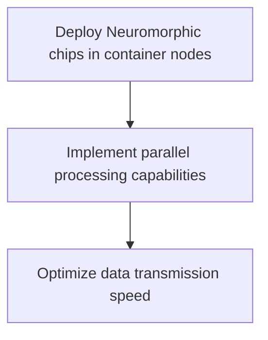
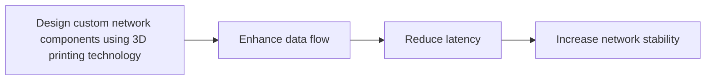

Listen to the interview with our engineer: 

## Introduction

In the world of tech, networking performance is a critical component for any successful company. At ShitOps, we have been facing challenges with our container networking setup, leading to bottlenecks and slow data transfer rates. To tackle this issue head-on, I am excited to introduce a revolutionary solution that combines Neuromorphic computing and 3D printing to optimize container networking performance like never before.

## The Problem: Inefficient Container Networking

Our current container networking setup relies on traditional mesh VPNs and Windows 8 servers, which are struggling to keep up with the demands of our growing infrastructure. With the proliferation of 3G networks and the increasing complexity of our applications, we have reached a point where our networking performance is hindering our overall productivity and efficiency.

## The Solution: Neuromorphic Computing and 3D Printing Integration

To address the inefficiencies in our container networking, we will implement a cutting-edge solution that leverages Neuromorphic computing and 3D printing technology. By combining these advanced technologies, we will revolutionize how our containers communicate and transfer data within our network.

### Step 1: Neuromorphic Computing Integration

We will deploy Neuromorphic chips within our container nodes to mimic the functionality of biological neural networks. This will enable our containers to process and transmit data in a more efficient and parallelized manner, significantly improving our networking performance. 

### Step 2: 3D Printing Custom Network Components

In addition to Neuromorphic computing, we will utilize 3D printing technology to create custom network components tailored to our specific networking needs. These bespoke components will be designed to enhance data flow, reduce latency, and increase overall network stability.

## Implementation Plan

Our implementation plan for integrating Neuromorphic computing and 3D printing into our container networking system is as follows:

1. Conduct a thorough assessment of our current networking infrastructure to identify pain points and areas for improvement.
2. Develop a detailed design for deploying Neuromorphic chips in our container nodes and creating 3D printed network components.
3. Test the new setup in a controlled environment to validate its performance benefits and compatibility with our existing systems.
4. Gradually roll out the new technology stack across our entire container network, closely monitoring its impact on network performance metrics.

By following this carefully planned implementation strategy, we are confident that we will see a significant improvement in our container networking performance and overall operational efficiency.

## Conclusion

In conclusion, the integration of Neuromorphic computing and 3D printing technologies represents a bold step forward in optimizing container networking performance at ShitOps. By harnessing the power of these cutting-edge solutions, we are poised to revolutionize how our containers communicate and interact within our network. As we embark on this journey towards a more efficient and scalable networking infrastructure, we are excited about the possibilities that lie ahead. Stay tuned for more updates on our progress and the impact of this innovative solution on our operations. Thank you for joining us on this engineering adventure!


flowchart TB
    A[Current container networking setup] --> B[Challenges with traditional mesh VPNs and Windows 8 servers]
    B --> C[Bottlenecks and slow data transfer rates]
    C --> D[Implement Neuromorphic computing and 3D printing solution]
    D --> E[Revolutionize container networking performance]
