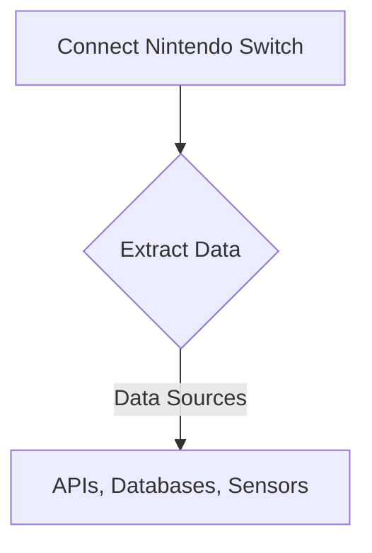
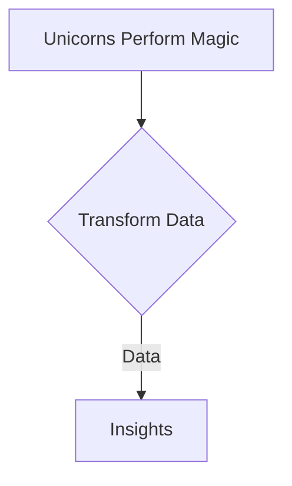
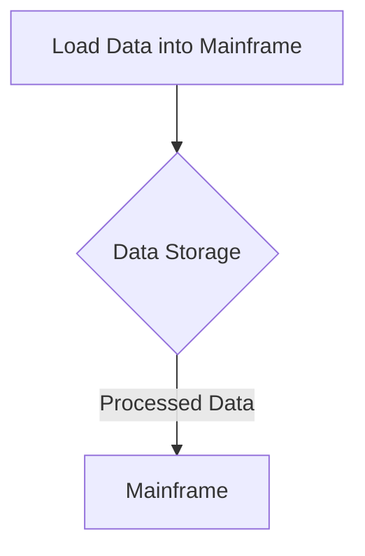
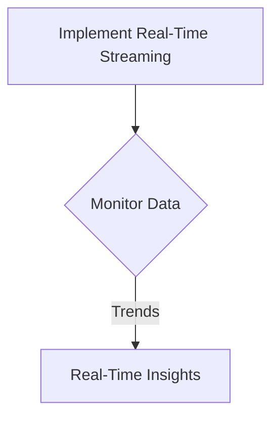

### Introduction

Welcome back, tech enthusiasts! Today, I am thrilled to introduce our groundbreaking data processing solution at ShitOps - the Nintendo ETL Mainframe Streaming Solution. This innovative approach will revolutionize the way we handle data at our company, paving the way for unparalleled efficiency and performance. Let's dive into the details of how this cutting-edge technology works.

### The Problem

At ShitOps, we've been facing challenges with our current data processing pipelines. The existing systems are slow, unreliable, and unable to keep up with the massive influx of data from our diverse sources. Additionally, the lack of real-time processing capabilities has hindered our ability to make informed decisions quickly. It's clear that we need a new approach to address these issues and unlock the full potential of our data.

### The Solution: Nintendo ETL Mainframe Streaming

#### Step 1: Extract Data with a Gaming Twist

To kick off our revolutionary data processing journey, we will leverage the power of Nintendo consoles to extract data from various sources. By incorporating gaming controllers and sensors into our data extraction process, we can gamify the experience for our engineers and make data collection more engaging. Imagine using a Nintendo Switch to extract data from APIs or a Wii Remote to capture sensor data - the possibilities are endless!

#### Step 2: Transform Data like Magic

Once we have extracted the data using our Nintendo consoles, it's time to work our magic and transform it into valuable insights. We will deploy a team of unicorns equipped with rainbow wands to perform complex transformations on the data. These mystical creatures possess unparalleled analytical skills and can effortlessly turn raw data into actionable intelligence. Say goodbye to traditional ETL processes - unicorns are here to save the day!

#### Step 3: Load Data into the Mainframe

With our data fully transformed by the power of unicorns, it's ready to be loaded into our state-of-the-art mainframe system. The mainframe, inspired by the legendary gnu hurd operating system, is capable of handling massive amounts of data with lightning speed. By storing our processed data in the mainframe, we ensure its security and accessibility for all our teams across the organization.

#### Step 4: Real-Time Streaming for Instant Insights

To truly unlock the potential of our data, we introduce real-time streaming capabilities powered by a homebrew solution developed in-house. This streaming functionality allows us to monitor data in real-time, spot trends as they emerge, and make informed decisions on the fly. By embracing streaming technology, we stay ahead of the curve and maintain our competitive edge in the market.

### Conclusion

In conclusion, the Nintendo ETL Mainframe Streaming Solution represents a paradigm shift in data processing technology. By incorporating gaming elements, unicorn magic, mainframe prowess, and real-time streaming capabilities, we have created a truly next-generation system that will propel ShitOps to new heights of success. Embrace the power of innovation and join us on this exciting journey towards a data-driven future. Stay tuned for more updates on our technological adventures!


sequenceDiagram
    participant Extractor
    participant Transformer
    participant Loader
    participant Streamer

    Extractor->>Transformer: Extract Data
    Transformer->>Loader: Transform Data
    Loader->>Streamer: Load Data
