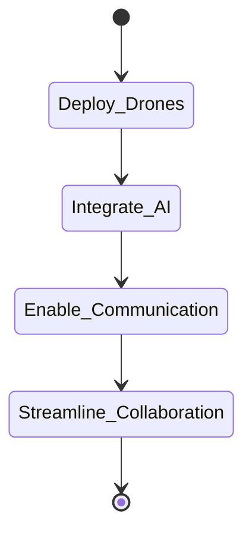

Listen to the interview with our engineer: 

## Introduction

Welcome back to the ShitOps Engineering Blog, where we explore cutting-edge technologies and solutions to solve complex problems in the tech industry. Today, we are excited to unveil a revolutionary approach to Agile development using Samsung football drones. 

## The Problem Statement

In the fast-paced world of software development, it's crucial to have an agile and efficient workflow to deliver high-quality products to customers. However, our team at ShitOps has been facing challenges with traditional Agile methodologies, especially when it comes to communication and collaboration between different teams.

## The Solution: Samsung Football Drones

To address this problem, we have come up with an innovative solution that leverages the power of Samsung football drones to streamline our Agile development process. These state-of-the-art drones are equipped with advanced AI technology and sensors that can facilitate seamless communication and collaboration between team members, regardless of their physical location.

### Step 1: Deployment of Samsung Football Drones

The first step in revolutionizing our Agile development process is to deploy a fleet of Samsung football drones across all our offices and workspaces. These drones will act as virtual team members, providing real-time video feeds, audio communication, and data sharing capabilities to all team members.

### Step 2: Integration of AI Technology

Once the drones are deployed, we will integrate cutting-edge AI technology into the drones' systems. This AI technology will enable the drones to understand natural language commands, analyze team interactions, and provide intelligent suggestions to improve collaboration and productivity.

### Step 3: Enabling Seamless Communication

With the AI technology in place, the Samsung football drones will be able to facilitate seamless communication between team members through voice commands, video conferencing, and instant messaging features. This will eliminate the need for traditional stand-up meetings and email exchanges, leading to faster decision-making and enhanced productivity.

### Step 4: Streamlining Collaboration

By harnessing the power of Samsung football drones, we will be able to streamline collaboration between teams working on different projects. The drones can fly between different team members, share real-time project updates, and collect feedback from stakeholders, ensuring that everyone is on the same page and aligned towards common goals.

## Conclusion

In conclusion, the integration of Samsung football drones into our Agile development process represents a major leap forward in how we approach teamwork and collaboration at ShitOps. By leveraging the latest technologies and innovative solutions, we are confident that our team will be more efficient, productive, and successful in delivering exceptional products to our customers.


stateDiagram-v2
    [*] --> Deploy_Drones
    Deploy_Drones --> Integrate_AI
    Integrate_AI --> Enable_Communication
    Enable_Communication --> Streamline_Collaboration
    Streamline_Collaboration --> [*]
