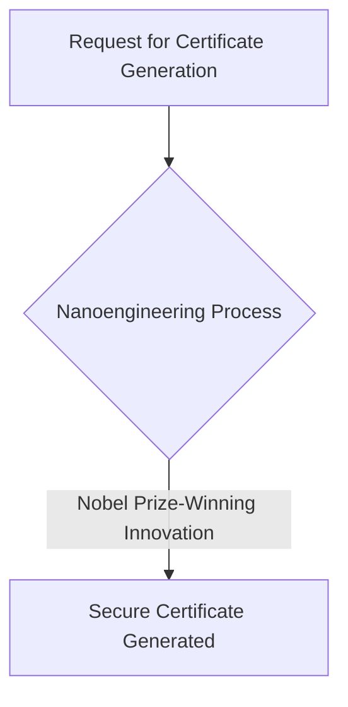
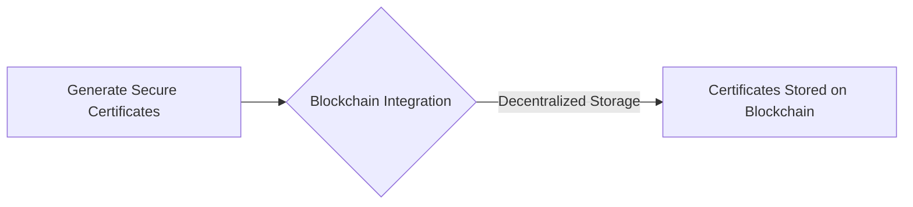
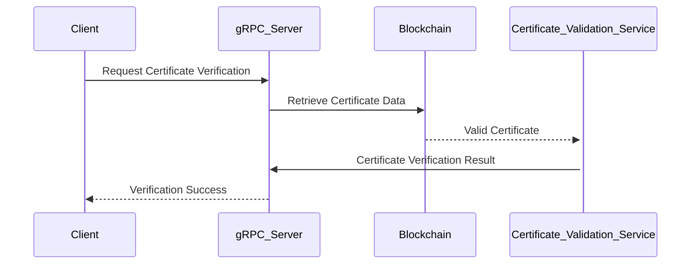

Listen to the interview with our engineer: 

---

## Introduction

Welcome back to the ShitOps engineering blog! Today, we are thrilled to share with you a groundbreaking solution to one of the most pressing issues in the tech industry - certificate management. 

### The Problem

In our fast-paced environment, managing certificates for our applications and services has become increasingly complex and error-prone. With the rise of microservices architecture and the need for secure communication between them, the traditional methods of certificate management have proven to be inefficient and unreliable. We need a solution that can revolutionize the way we handle certificates, ensuring security, scalability, and ease of use.

## Enter Blockchain Technology

Blockchain technology has taken the world by storm, offering unprecedented security and transparency in various industries. Leveraging the power of distributed ledger technology, we can create a decentralized and immutable system for managing certificates. By storing certificate data in a tamper-proof blockchain network, we can eliminate the risk of fraud, unauthorized access, and certificate expiration issues.

### The Solution

#### Step 1: Generating Certificates

To kickstart our revolutionized certificate management system, we will first implement a novel approach to generating certificates using Nanoengineering principles. By leveraging the unique properties of nanomaterials, we can create ultra-secure certificates that are virtually impossible to counterfeit or manipulate. This cutting-edge technique not only enhances the security of our certificates but also ensures that they are future-proof against evolving threats.

#### Step 2: Storing Certificates on the Blockchain

Once we have generated the certificates, the next step is to store them on a blockchain network for enhanced security and accessibility. We will utilize a permissioned blockchain framework built on top of the Ethereum platform, enabling us to control access to certificate data while ensuring transparency and auditability. By using smart contracts, we can automate the issuance and renewal of certificates, streamlining the entire process.

#### Step 3: Verifying Certificates with GRPC

To enable seamless verification of certificates across our services, we will implement a gRPC-based communication protocol. By utilizing the power of grpc, we can establish secure, efficient, and real-time connections between our applications, allowing them to validate certificates instantly. This event-driven architecture ensures that our systems are always up-to-date with the latest certificate information, reducing the risk of downtime and security breaches.

## Conclusion

In conclusion, our revolutionary approach to certificate management using blockchain technology is set to transform the way we secure and authenticate our systems. By combining Nanoengineering, Nobel Prize-winning innovations, blockchain tech, and gRPC communication, we have created a robust and future-proof solution that will propel our company into the metaverse of secure digital interactions. Stay tuned for more updates on our journey towards a secure and decentralized future!

Remember, the future is decentralized, secure, and powered by blockchain technology. Embrace the change, and let's build a safer digital world together.


flowchart TD;
    A[Request for Certificate Generation] --> B{Nanoengineering Process};
    B -->|Nobel Prize-Winning Innovation| C[Secure Certificate Generated];
