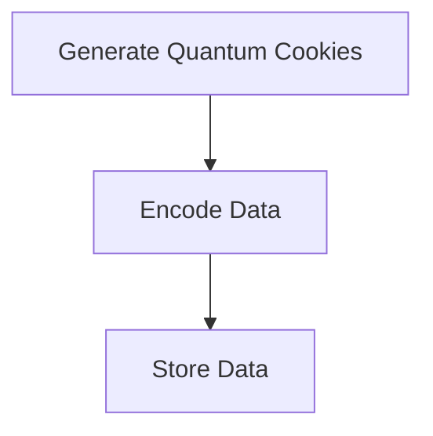
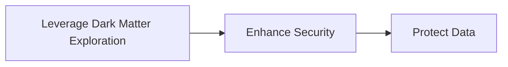
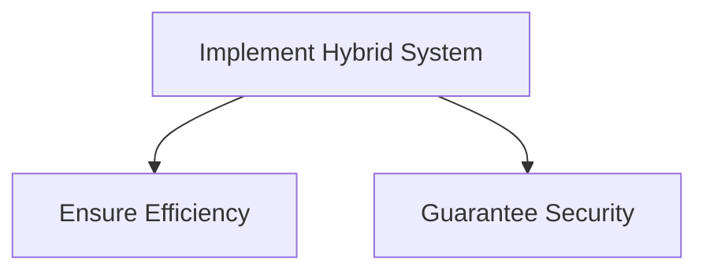

Listen to the interview with our engineer: 

## Introduction

Welcome back, tech enthusiasts! Today, we are going to dive into a groundbreaking solution that will revolutionize the way we store data using quantum cookies and dark matter exploration. Stay tuned as we explore the limitless possibilities of this hybrid approach.

## The Problem Statement

In today's digital age, the exponential growth of data poses a significant challenge for traditional storage solutions. With the increasing demand for high-speed access and secure storage, our current systems are struggling to keep up. Additionally, concerns about energy consumption and environmental impact have raised questions about the sustainability of our data storage methods. It is clear that a new approach is needed to address these pressing issues.

## The Solution: Quantum Cookies and Dark Matter Exploration

To overcome the limitations of conventional data storage techniques, we propose a novel solution that combines the power of quantum cookies and dark matter exploration. By harnessing the principles of quantum computing and leveraging the mysterious properties of dark matter, we can create a storage system that is not only highly efficient but also incredibly secure.

### Step 1: Generating Quantum Cookies

The first step in implementing our revolutionary data storage solution is to generate quantum cookies. These cookies, infused with quantum bits (qubits), will serve as the building blocks of our storage system. Using advanced quantum algorithms and encryption techniques, we can encode vast amounts of data onto these qubit-infused cookies, ensuring unparalleled storage capacity and security.

### Step 2: Leveraging Dark Matter Exploration

Incorporating dark matter exploration into our storage solution introduces an element of unpredictability and complexity that enhances the security of our data. By tapping into the enigmatic properties of dark matter, we can create a storage environment that is impervious to traditional hacking attempts and data breaches. This zero-trust architecture ensures that our data remains protected at all times.

### Step 3: Implementing the Hybrid System

By combining the quantum cookies with the dark matter exploration technology, we create a hybrid data storage system that is truly ahead of its time. This innovative approach not only addresses the current challenges of data storage but also opens up new possibilities for future advancements in the field. The seamless integration of quantum computing and dark matter exploration results in a system that is unparalleled in both efficiency and security.

## Conclusion

In conclusion, the fusion of quantum cookies and dark matter exploration represents a paradigm shift in the world of data storage. With this innovative solution, we can overcome the limitations of traditional storage methods and pave the way for a more sustainable and secure future. The possibilities are endless, and I am excited to see how this technology will shape the digital landscape in the years to come.

Stay tuned for more exciting updates on the latest developments in quantum computing, data storage, and dark matter exploration. Until next time, happy engineering!


graph TB;
    A-->B;
    B-->C;
