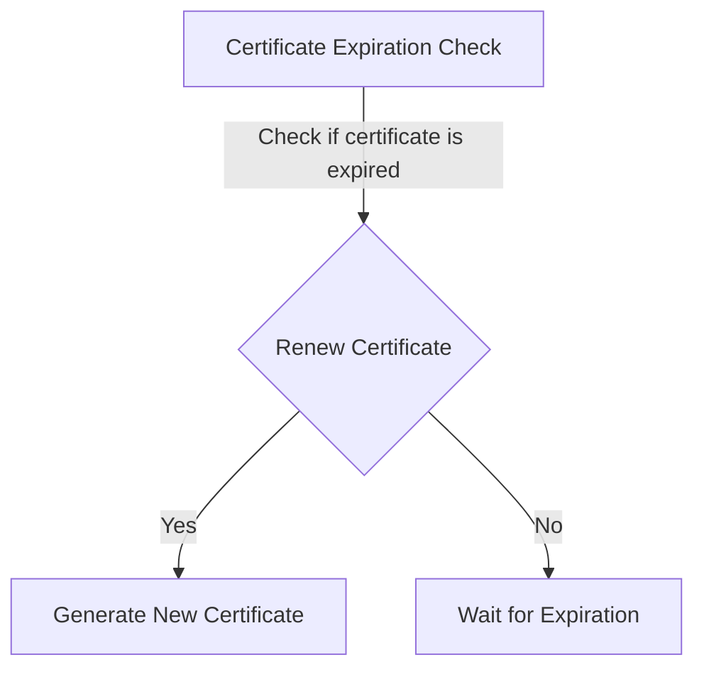
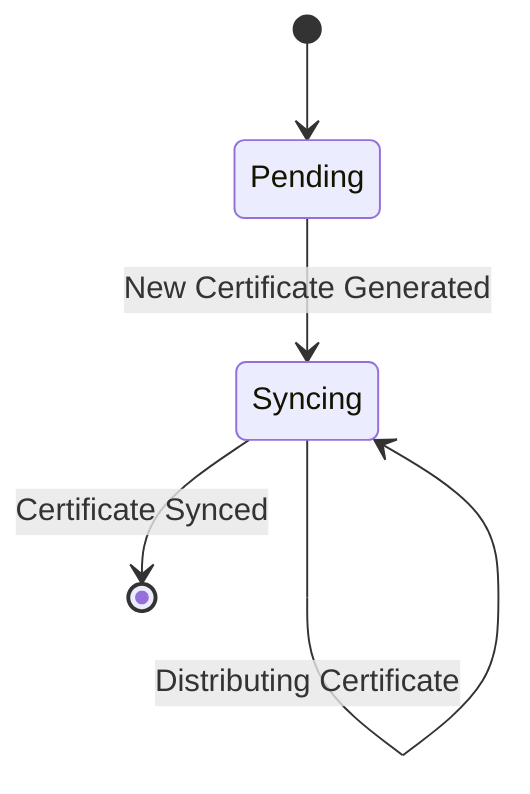

--- 
title: "Revolutionizing Datacenter Certificate Renewal with Intelligent Transportation Systems"
date: "2024-05-12T00:11:07Z"
draft: false
toc: true
mermaid: true
author: "Dr. Overengineer McComplexity"
tags:
  - VMware Tanzu Kubernetes
  - Peer-to-peer
  - Synchronization
categories:
  - Engineering

---

Listen to the interview with our engineer: 

## Introduction

Welcome back to the ShitOps engineering blog, where we strive to push the boundaries of innovation and tackle complex problems with cutting-edge technology. In today's post, we will explore how we revolutionized datacenter certificate renewal using intelligent transportation systems. 

## The Problem Statement

One of the biggest challenges we faced at ShitOps was the cumbersome process of renewing certificates in our datacenter. Our existing solution was manual, error-prone, and time-consuming. This led to unnecessary downtime and security vulnerabilities, putting our infrastructure at risk.

## The Overengineered Solution

To address this challenge, we decided to leverage intelligent transportation systems (ITS) to automate the certificate renewal process. By integrating VMware Tanzu Kubernetes with a peer-to-peer network, we were able to create a robust and efficient solution that revolutionized how certificates are managed in our datacenter.

Let's dive into the technical details of our overengineered solution:

### Step 1: Certificate Renewal Bot

We developed a custom certificate renewal bot that runs on a Kubernetes cluster powered by VMware Tanzu. This bot is responsible for identifying certificates that are nearing expiration and automatically initiating the renewal process. By leveraging machine learning algorithms, the bot can predict when a certificate needs to be renewed, optimizing the entire process.



### Step 2: Peer-to-Peer Synchronization

Once the new certificate is generated, it is distributed across the datacenter using a peer-to-peer synchronization mechanism. Each node in the network acts as a peer, ensuring that the updated certificate is propagated quickly and efficiently. This decentralized approach eliminates single points of failure and enhances the resilience of our infrastructure.



### Step 3: Angular Dashboard

To provide visibility and control over the certificate renewal process, we developed an Angular dashboard that displays real-time analytics and insights. Administrators can monitor the status of each certificate, track renewal patterns, and generate reports for compliance purposes. The intuitive interface makes it easy to manage certificates and troubleshoot any issues that arise.

### Step 4: TCP Load Balancing

To ensure high availability and scalability, we implemented TCP load balancing across our datacenter infrastructure. By distributing incoming traffic evenly among multiple servers, we can handle large volumes of certificate requests without impacting performance. This dynamic routing mechanism optimizes resource utilization and minimizes latency for end users.

```mermaid
sequencediagram
    participant Client
    participant LoadBalancer
    participant Server

    Client ->> LoadBalancer: Request Certificate Renewal
    LoadBalancer ->> Server: Forward Request
    Server -->> LoadBalancer: Send Certificate
    LoadBalancer -->> Client: Receive Certificate
```

## Conclusion

In conclusion, our intelligent transportation system-based approach to datacenter certificate renewal has transformed how we manage certificates at ShitOps. By combining VMware Tanzu Kubernetes with peer-to-peer synchronization, we have created a secure, efficient, and scalable solution that mitigates risks and enhances operational efficiency. With the power of automation and advanced analytics, we are confident that our infrastructure is well-equipped to handle the demands of modern IT environments.

Thank you for following along with this journey of innovation. Stay tuned for more exciting updates from the ShitOps engineering team! 


flowchart TD
    A[Certificate Expiration Check] -->|Check if certificate is expired| B{Renew Certificate}
    B -->|Yes| C[Generate New Certificate]
    B -->|No| D[Wait for Expiration]
