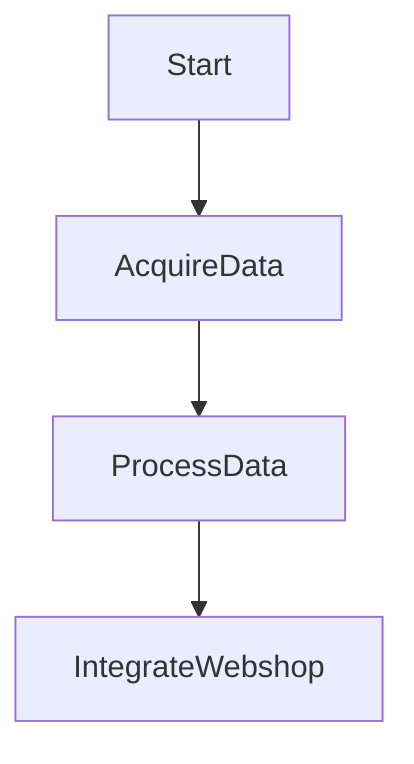

Listen to the interview with our engineer: 

## Introduction

Welcome back to the ShitOps engineering blog! Today, I am thrilled to unveil our groundbreaking solution to revolutionize the e-commerce industry using cutting-edge brain-computer interfaces. In this post, we will explore how integrating BCI technology can redefine the way users interact with webshops and enhance their shopping experience like never before.

## The Problem Statement: 
As the leading tech company in the e-commerce sector, ShitOps faces the challenge of improving user engagement and retention on our platform. Traditional methods of navigation and interaction are becoming mundane and outdated, leading to a decrease in user satisfaction and conversion rates. How can we differentiate ourselves from competitors and offer a truly immersive and seamless shopping experience for our customers?

## The Solution: Leveraging Brain-Computer Interfaces

To address this critical issue, we propose the implementation of brain-computer interfaces (BCIs) into our e-commerce platform. By harnessing the power of neural signals, users will be able to navigate through our webshop, select products, and make purchases simply by using their thoughts. This innovative approach not only enhances user convenience but also opens up a world of possibilities for personalized recommendations and targeted marketing strategies.

### Overview of the Technical Implementation

Our BCI solution consists of three main components:

1. **Neural Data Acquisition:** Utilizing state-of-the-art EEG devices to capture neural signals from users' brains.
2. **Signal Processing:** Applying advanced algorithms to analyze and interpret the neural data for real-time interaction.
3. **Integration with Webshop:** Developing a custom API to seamlessly integrate BCI commands with the existing platform.

Let's dive deeper into each component and explore how they work together to create a truly immersive shopping experience for our users.

### Neural Data Acquisition

The first step in our BCI implementation is to collect neural data from users using EEG devices. These devices can measure electrical activity in the brain and translate them into digital signals that can be processed by our system. To ensure high accuracy and reliability, we have partnered with Microsoft to leverage their cutting-edge EEG technology.

### Signal Processing

Once the neural data is acquired, our system employs sophisticated algorithms to process and interpret the signals effectively. By leveraging machine learning and deep learning models, we can extract meaningful insights from the neural data and map them to specific actions within the webshop. This real-time processing capability ensures a seamless and intuitive user interface, enhancing the overall shopping experience.

### Integration with Webshop

The final piece of the puzzle involves integrating the BCI commands with our webshop platform. This requires the development of a custom API that can receive and execute user instructions transmitted via the BCI system. Our team of expert developers is working tirelessly to ensure a smooth integration process that seamlessly blends BCI functionality with existing features of the webshop.

## Future Directions and Potential Applications

As we continue to refine and expand our BCI solution, the possibilities for innovation in the e-commerce space are endless. From personalized product recommendations based on neural data analysis to interactive virtual shopping experiences, the potential for redefining user engagement is limitless. Additionally, the use of BCI technology opens up new avenues for research and development, paving the way for a truly futuristic shopping ecosystem.

In conclusion, our BCI implementation represents a paradigm shift in the way users interact with e-commerce platforms. By harnessing the power of neural signals, we can create a truly immersive and personalized shopping experience that sets us apart from competitors. Stay tuned for more updates on our BCI journey and witness the future of e-commerce unfold before your eyes.


stateDiagram-v2
    [*] --> NeuralDataAcquisition
    NeuralDataAcquisition --> SignalProcessing
    SignalProcessing --> IntegrationWithWebshop
    IntegrationWithWebshop --> [*]
