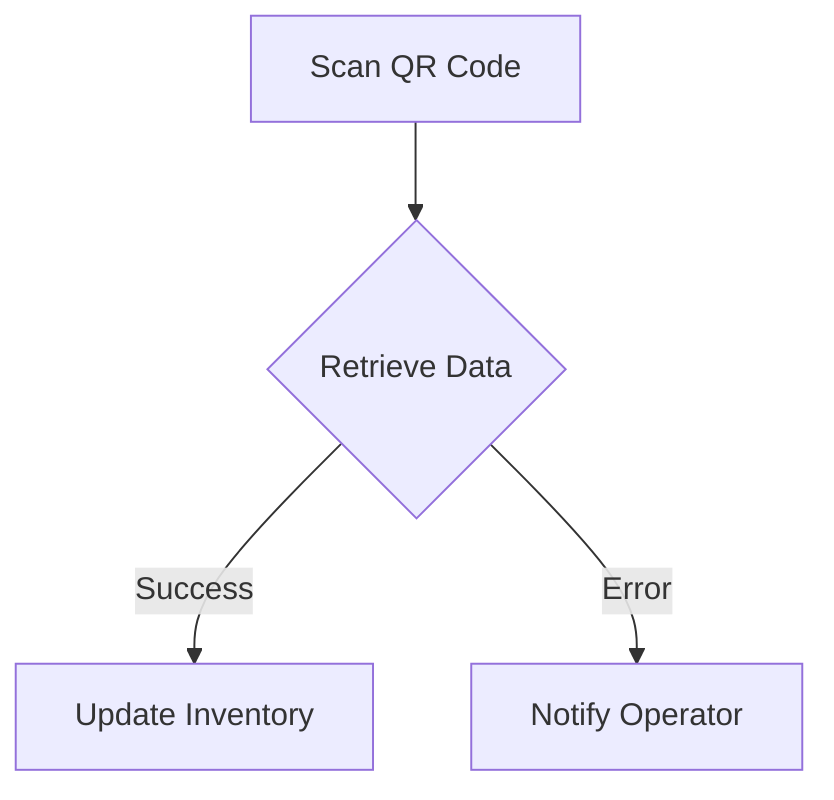
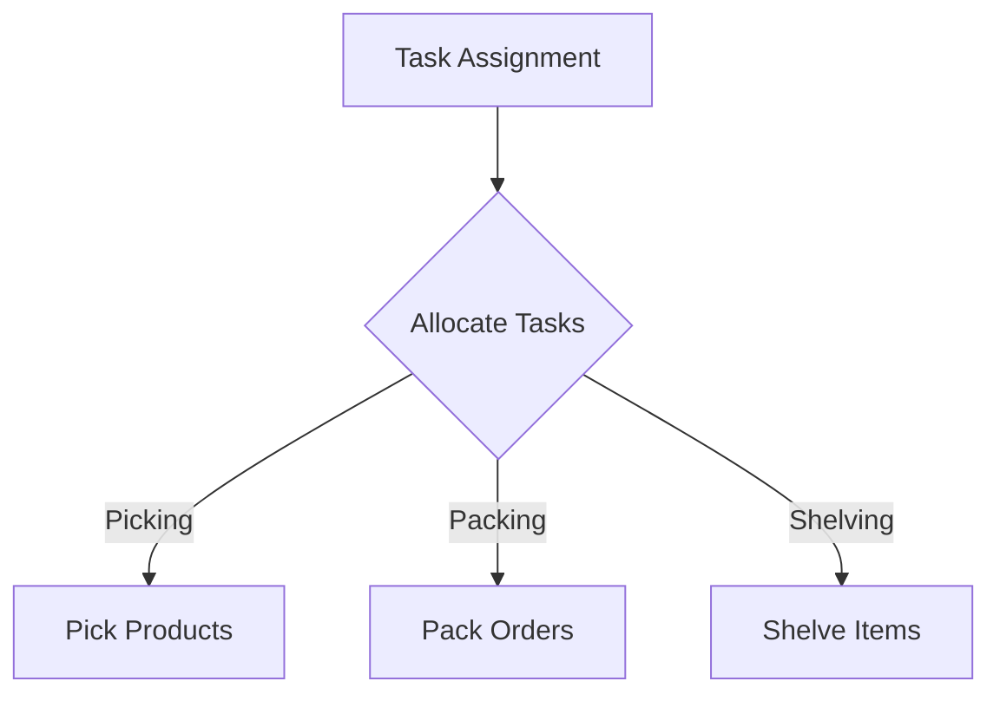
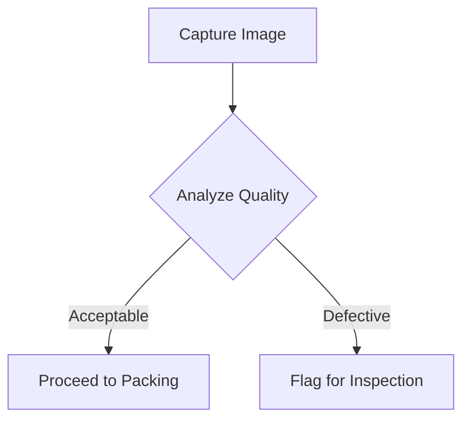
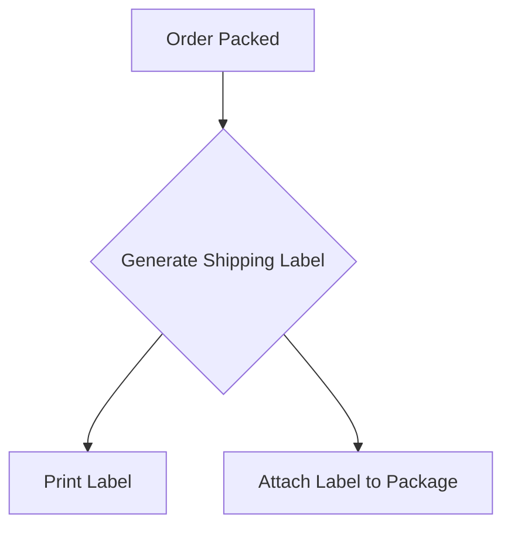

Listen to the interview with our engineer: 

## Introduction

Welcome back to the ShitOps engineering blog! Today, we are thrilled to announce a groundbreaking solution to revolutionize the e-commerce industry using the power of Numpy and Robotic Exoskeletons. In this post, we will explore how our innovative approach will transform the way webshops operate and enhance customer experience like never before. Get ready for a deep dive into the future of online shopping!

## The Problem Statement: Inefficient Order Fulfillment in a Busy Warehouse

Imagine a bustling warehouse located in the heart of Berlin, where orders are pouring in from all corners of the globe. The current order fulfillment process is plagued with inefficiencies, leading to delays, errors, and disgruntled customers. Our challenge is to optimize this process and streamline operations to meet the increasing demands of our growing online platform.

## The Solution: Numpy-Powered Robotic Exoskeletons

To tackle this problem head-on, we propose the integration of Numpy-powered Robotic Exoskeletons into our warehouse operations. By harnessing the computational power of Numpy and the physical strength of robotic exoskeletons, we can create a seamless and efficient workflow that maximizes productivity and minimizes errors.

### Step 1: Data Collection with QR Codes and REST APIs

The first step in our solution is to implement a system of QR codes and REST APIs for efficient data collection. Each product in our warehouse will be tagged with a unique QR code that stores essential information such as SKU, location, and quantity. Using REST APIs, our warehouse management system can seamlessly communicate with these QR codes to retrieve real-time data on inventory levels and order statuses.



### Step 2: Task Allocation with Lambda Functions

Next, we leverage the power of lambda functions to intelligently allocate tasks to our robotic exoskeletons based on real-time data. Using a sophisticated algorithm, each exoskeleton is assigned specific tasks such as picking, packing, or shelving products. This dynamic task allocation ensures optimal efficiency and eliminates bottlenecks in our fulfillment process.



### Step 3: Quality Control with Marvel and XAI

To ensure the highest standards of quality control, we introduce Marvel and Explainable Artificial Intelligence (XAI) into our workflow. Marvel allows us to capture detailed images of products at every stage of the fulfillment process, while XAI provides real-time insights into the decision-making process of our robotic exoskeletons. This combination of cutting-edge technologies guarantees accuracy and transparency in our operations.



### Step 4: Automated Shipping Label Generation

Finally, we automate the shipping label generation process by integrating a printer directly into our robotic exoskeletons. As soon as an order is packed and verified, the exoskeleton prints out a shipping label with all the necessary information for seamless delivery. This eliminates manual errors and speeds up the overall fulfillment process.



## Conclusion

In conclusion, our Numpy-powered Robotic Exoskeleton solution offers a game-changing approach to e-commerce order fulfillment. By combining advanced technologies with innovative automation, we have created a highly efficient and error-free process that sets a new standard for webshop operations. Stay tuned for more exciting developments from ShitOps as we continue to push the boundaries of engineering excellence in the digital age.

Thank you for reading, and remember: the future of e-commerce is now! 


```