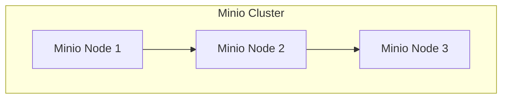

Podcast Placeholder

## Introduction

At ShitOps, we have been facing a common problem that many tech companies encounter - the lack of centralized documentation for our email infrastructure. With teams working on various projects and constantly changing configurations, it has become increasingly difficult to keep track of all the important information related to our email servers. This has led to inefficiencies, misunderstandings, and unnecessary delays in our operations.

In this blog post, I am thrilled to introduce our revolutionary solution to this problem - integrating Minio with our email documentation process. By leveraging the power of Minio, a high-performance distributed object storage server, we can finally achieve a seamless and efficient documentation system for our email infrastructure.

## The Problem

Our current documentation process for email servers is fragmented and outdated. Each team member maintains their own set of notes, which often leads to inconsistencies and errors. When troubleshooting issues or making changes to the configuration, it is challenging to ensure that everyone is on the same page. This lack of centralized documentation has become a significant pain point for our team, impacting our productivity and causing unnecessary confusion.

## The Solution

To address this challenge, we have devised a comprehensive solution that leverages Minio's powerful features to create a centralized repository for all our email documentation. By storing detailed information about our email servers, configurations, and best practices in Minio buckets, we can establish a single source of truth that is accessible to all team members. This will streamline our operations, improve collaboration, and enhance the overall efficiency of our email infrastructure management.

### Architecture Overview

To implement this solution, we have designed a sophisticated architecture that incorporates various technologies and frameworks to ensure robustness and scalability. Let's dive into the details of each component:

#### Minio Object Storage

First and foremost, we will deploy a cluster of Minio servers to serve as the backbone of our centralized documentation system. By distributing our documentation across multiple Minio nodes, we can achieve high availability and fault tolerance, ensuring that our critical information is always accessible. Additionally, Minio's compatibility with the S3 API makes it easy to integrate with our existing tools and workflows.

#### Email Documentation Service

To interact with the Minio cluster and manage our email documentation, we will develop a custom Flask application that serves as the frontend for our system. This application will allow team members to view, edit, and update documentation in real-time, ensuring that everyone has access to the latest information. Additionally, the Flask app will provide role-based access control to restrict sensitive information only to authorized personnel.

#### Automated Documentation Sync

To ensure that our documentation remains up-to-date at all times, we will implement an automated syncing mechanism that regularly checks for changes in our email infrastructure and updates the corresponding documentation in Minio. By integrating this syncing process into our CI/CD pipelines, we can guarantee that any configuration changes or updates are immediately reflected in our centralized repository.

### Implementation Steps

Now that we have outlined the key components of our solution, let's walk through the implementation steps to deploy our Minio-integrated email documentation system:

1. Deploy the Minio cluster with at least three nodes to ensure redundancy and fault tolerance.
2. Set up the Flask application on a dedicated server, configured with HTTPS encryption for secure communication.
3. Establish role-based access control in the Flask app to restrict permissions based on user roles and responsibilities.
4. Develop and deploy the automated documentation sync script, leveraging Minio's SDK to interact with the object storage cluster.
5. Integrate the syncing process into our CI/CD pipelines to automatically update documentation when changes are detected.

By following these steps, we can transform our scattered and outdated email documentation process into a streamlined, centralized system that empowers our team to work more efficiently and collaboratively.

## Conclusion

In conclusion, the integration of Minio with our email documentation process represents a significant leap forward for our team at ShitOps. By centralizing our documentation using Minio's robust object storage capabilities, we can eliminate inconsistencies, improve collaboration, and enhance the overall efficiency of our email infrastructure management. With this innovative solution in place, we are confident that we can tackle any challenges that come our way and continue to strive for excellence in all our operations.


flowchart LR
    A[Current Email Documentation Process] --> B[Fragmented Notes]
    B --> C[Inconsistencies and Errors]
    A --> D[Centralized Minio Integration]
    D --> E[Single Source of Truth]
    E --> F[Streamlined Operations]
