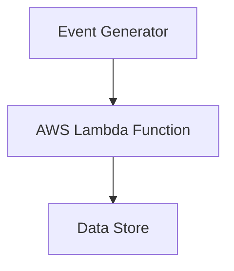
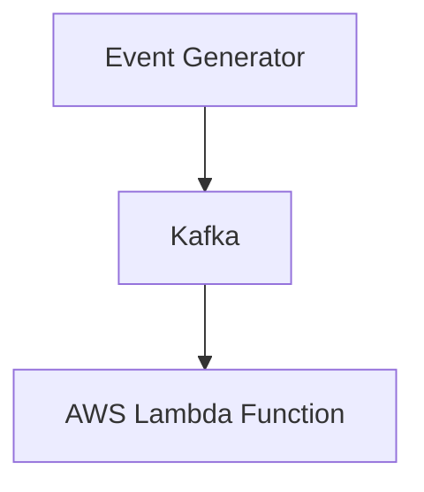
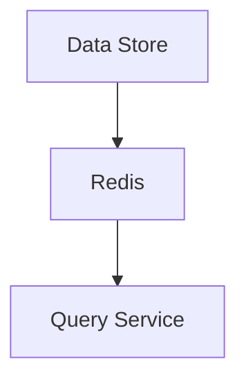
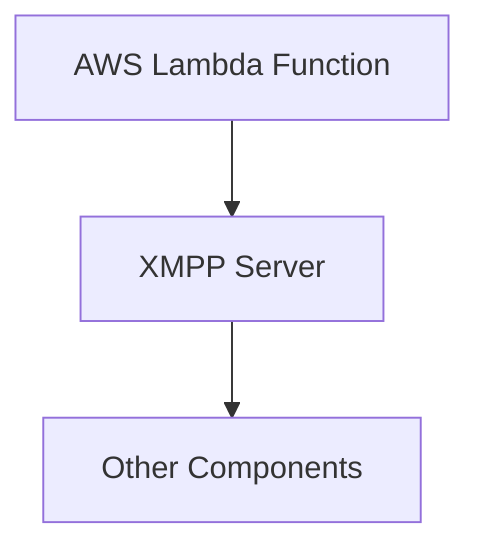
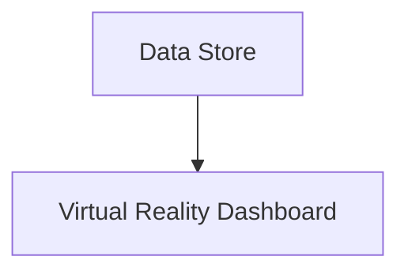

## Introduction

Welcome back, tech enthusiasts! Today, we're going to delve into the world of event-driven architecture and explore a groundbreaking solution that will revolutionize the way tech companies handle data processing in real-time.

## The Problem Statement

Imagine you work at a tech company, let's call it ShitOps, where real-time data processing is crucial for their operations. The current system in place is struggling to keep up with the increasing volume of events being generated every second. As a result, there are delays in data processing, leading to potential issues in decision-making and operational efficiency.

## The Overengineered Solution

To tackle this problem head-on, we propose a cutting-edge solution that leverages the power of AWS services, Kafka, Redis, and Event-driven programming. Brace yourselves for an overengineered, but highly innovative, approach to handling real-time data processing at ShitOps.

### Step 1: AWS Lambda Function Triggered by Events

First and foremost, we will set up AWS Lambda functions that are triggered by incoming events. These Lambda functions will be responsible for processing the events in real-time and storing the data in a centralized data store for further analysis.

### Step 2: Kafka for Real-Time Data Streaming

Next, we will implement Kafka as a distributed streaming platform to handle the high volume of events being generated. Kafka will act as a buffer between the event sources and our processing system, ensuring seamless data streaming and scalability.

### Step 3: Redis for In-Memory Caching

To optimize data retrieval and enhance performance, we will incorporate Redis as an in-memory caching system. Redis will cache frequently accessed data, reducing latency and improving overall system responsiveness.

### Step 4: Event-Driven Architecture with XMPP Integration

In order to enable seamless communication between systems, we will implement an Event-driven architecture with XMPP integration. This will allow different components of our system to exchange real-time messages, ensuring smooth coordination and data flow.

### Step 5: Virtual Reality Dashboard for Real-Time Monitoring

As a bonus feature, we will develop a Virtual Reality dashboard that provides real-time monitoring of the data processing pipeline. This immersive experience will allow users to visualize data streams, troubleshoot issues, and make informed decisions on the fly.

## Conclusion

And there you have it, folks! With this overengineered solution in place, ShitOps can now process real-time data more efficiently, paving the way for faster decision-making and improved operational performance. Remember, sometimes a little bit of overengineering can go a long way in pushing the boundaries of what is possible in the world of tech.

Keep innovating, stay ahead of the curve!


graph TD;
    A[Event Generator] --> B[AWS Lambda Function];
    B --> C[Data Store];
    C --> D[Redis];
    D --> E[Query Service];
