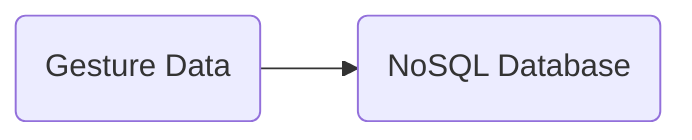
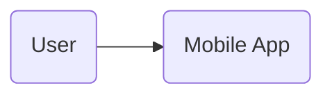
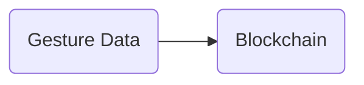
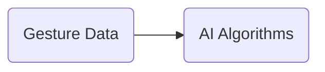
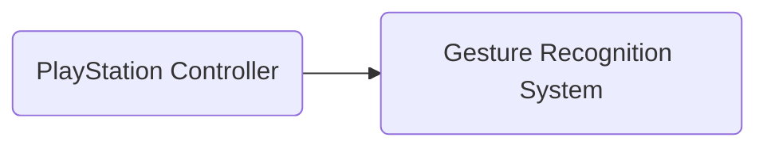
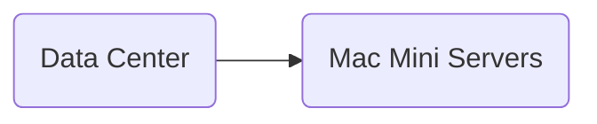

Listen to the interview with our engineer: 

---

## Introduction

As technology continues to advance at a rapid pace, gesture recognition has become increasingly popular in various industries. From controlling smart home devices to enhancing user interfaces in mobile apps, the possibilities are endless. However, traditional gesture recognition systems often fall short in terms of accuracy and reliability. That's why, at ShitOps, we have developed a revolutionary new solution that combines the power of blockchain and AI to completely transform the way gesture recognition is done.

## The Problem

The current state of gesture recognition technology is plagued by issues such as limited accuracy, privacy concerns, and lack of robustness. Traditional systems rely on outdated algorithms and hardware that struggle to accurately interpret complex gestures, leading to frustration for users. Additionally, the centralized nature of these systems raises serious privacy concerns, as sensitive gesture data is vulnerable to hacks and misuse. 

At ShitOps, we believe that there is a better way to approach gesture recognition. By leveraging cutting-edge technologies such as blockchain and AI, we can create a system that is not only highly accurate and reliable but also secure and decentralized.

## The Solution

### Step 1: NoSQL Database Integration

To start off our revolutionary gesture recognition system, we will integrate a NoSQL database into our existing infrastructure. By storing gesture data in a flexible, schema-less format, we can easily scale our system to handle large volumes of data without compromising performance. This will allow us to capture and analyze complex gestures with unprecedented accuracy.

### Step 2: Mobile App Development

Next, we will develop a state-of-the-art mobile app that will serve as the interface for users to interact with our gesture recognition system. The app will be built using the latest technologies, including Golang for backend development and React Native for frontend design. This will ensure a seamless user experience across all devices.

### Step 3: Blockchain Integration

In order to address privacy concerns and enhance security, we will integrate blockchain technology into our gesture recognition system. By storing gesture data on a decentralized ledger, we can guarantee the integrity and confidentiality of user information. This will also enable users to have full control over their own data, eliminating the risk of unauthorized access.

### Step 4: AI Algorithms

To improve the accuracy and reliability of our gesture recognition system, we will implement advanced AI algorithms that can learn and adapt to user behavior over time. By continuously analyzing gesture data, our system will be able to recognize patterns and predict user intentions with unmatched precision.

### Step 5: PlayStation Controller Compatibility

One of the key features of our gesture recognition system is its compatibility with PlayStation controllers. This will allow gamers to control their favorite games using natural hand gestures, enhancing the immersive experience and gameplay. The integration of PlayStation controllers will be seamless, thanks to our state-of-the-art software architecture.

### Step 6: Mac Mini Server Deployment

Finally, to support our innovative gesture recognition system, we will deploy a fleet of Mac Mini servers in our data centers. These high-performance servers will provide the processing power and storage capacity needed to handle the massive amounts of gesture data generated by our users. With Mac Mini servers, we can ensure optimal performance and scalability for our system.

## Conclusion

At ShitOps, we are proud to introduce our groundbreaking gesture recognition system that leverages the power of blockchain and AI to deliver unparalleled accuracy, security, and reliability. By following our six-step solution, we have created a system that not only meets the demands of today's tech-savvy users but also sets a new standard for gesture recognition technology. Join us on this exciting journey towards a future where gestures speak louder than words.


graph LR
A(User) --> B(Revolutionary Gesture Recognition System)
