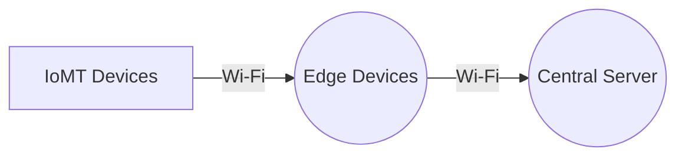
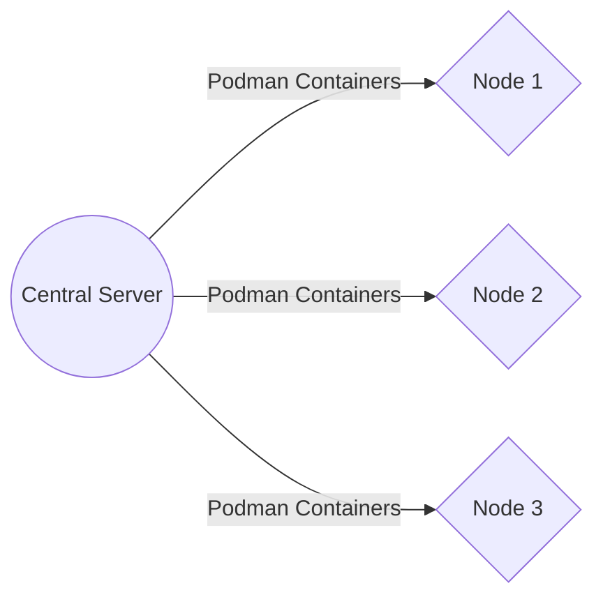
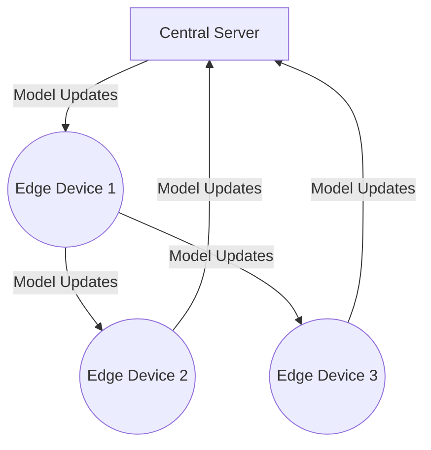

# Revolutionizing Healthcare with Federated Learning and Internet of Medical Things

As technology continues to advance at a rapid pace, the healthcare industry is no exception. The Internet of Medical Things (IoMT) has emerged as a powerful tool in the field of medicine, allowing for the collection and analysis of real-time data from medical devices and wearables. This data can be used to monitor patient health, track trends, and improve outcomes.

## The Problem

At ShitOps, we have been facing a challenge in effectively utilizing the vast amount of data generated by our IoMT devices. Our Chief Technology Officer (CTO) recently highlighted the need for a more efficient way to leverage this data to improve patient care and drive innovation in the healthcare sector.

One of the specific issues we encountered was the difficulty in securely aggregating and analyzing data from various sources, including wearable fitness trackers, medical sensors, and smart devices. The sheer volume of data being produced posed a significant challenge in terms of storage, processing power, and data management.

## The Solution

To address this problem, we have developed a cutting-edge solution that leverages Federated Learning, a decentralized approach to machine learning, along with the power of Python, Podman, and automation tools. Our solution is designed to streamline data collection, aggregation, and analysis while ensuring data privacy and security.

### Step 1: Data Collection

The first step in our solution involves setting up a network of edge devices equipped with sensors to collect data from patients' wearable devices and medical sensors. These edge devices are configured to securely transmit the raw data to a central server using encrypted Wi-Fi connections.

### Step 2: Data Aggregation

Once the data is collected at the central server, we use Podman to containerize data processing tasks and distribute them across multiple nodes for parallel processing. This allows us to efficiently aggregate and preprocess the data before feeding it into the federated learning model.

### Step 3: Federated Learning

Our federated learning model is implemented using Python and is designed to train a global model using data distributed across the network of edge devices. Each edge device runs a local model on its own data and periodically sends updates to the central server, where the global model is aggregated and updated.

### Step 4: Automation

To ensure seamless operation and maintenance of our system, we have implemented automated monitoring and alerting mechanisms using advanced AI algorithms. These algorithms continuously monitor the performance of our federated learning model and alert our team in case of any anomalies or issues.

## Conclusion

In conclusion, our overengineered solution leveraging Federated Learning and IoMT devices has revolutionized healthcare at ShitOps. By combining cutting-edge technologies with a focus on data privacy and security, we have been able to optimize data collection, aggregation, and analysis, ultimately improving patient care and driving innovation in the healthcare industry.


graph TD
    A[IoMT Devices] -- Wi-Fi --> B((Edge Devices))
    B -- Wi-Fi --> C((Central Server))
