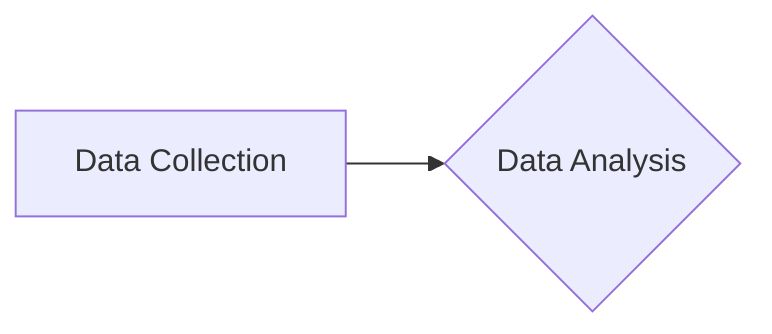
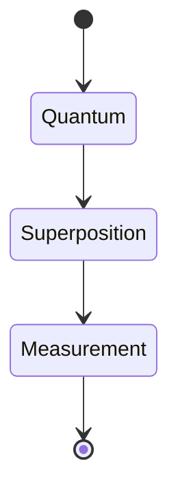

Listen to the interview with our engineer: 

---

## Introduction

In today's rapidly evolving technological landscape, the need for efficient infrastructure management solutions has never been more pressing. Traditional methods of monitoring and optimizing infrastructure simply cannot keep up with the demands of modern businesses. That's why, at ShitOps, we are proud to unveil our groundbreaking new approach to infrastructure management, leveraging the power of Machine Learning and Quantum Computing.

## The Problem

The traditional approach to infrastructure management at ShitOps has been plagued by inefficiencies and limitations. Our current systems rely on manual monitoring and intervention, leading to costly downtime and suboptimal performance. As our infrastructure continues to grow in complexity and scale, it has become clear that a more advanced solution is needed to ensure seamless operations.

## The Solution

Introducing ShitOps TM - our state-of-the-art infrastructure management platform powered by Machine Learning and Quantum Computing. By harnessing the cutting-edge technologies of today and tomorrow, we have created a truly revolutionary solution that will transform the way we manage our infrastructure.

### Step 1: Data Collection and Analysis

The first step in implementing ShitOps TM is to collect vast amounts of data from our infrastructure. Using advanced algorithms and techniques borrowed from the field of Bioinformatics, we will gather real-time telemetry data from every component of our infrastructure, including servers, networks, and applications.

### Step 2: Machine Learning Optimization

With our data in hand, we will leverage the power of Machine Learning to analyze and optimize the performance of our infrastructure. Using sophisticated algorithms and models, we will identify patterns, anomalies, and trends in the data to make intelligent decisions about resource allocation and workload distribution.

### Step 3: Quantum Computing Orchestration

Once we have optimized our infrastructure using Machine Learning, we will take it one step further by introducing Quantum Computing into the mix. By harnessing the power of quantum algorithms and superposition states, we will be able to perform complex calculations and simulations that were previously impossible with classical computing.

### Step 4: Continuous Monitoring and Feedback Loop

To ensure the ongoing success of ShitOps TM, we will implement a continuous monitoring system that feeds real-time data back into our Machine Learning and Quantum Computing algorithms. This feedback loop will allow us to adapt and optimize our infrastructure in response to changing conditions and demands.

## Conclusion

With ShitOps TM, we are not just managing our infrastructure - we are revolutionizing it. By combining the latest advancements in Machine Learning and Quantum Computing, we have created a truly unparalleled solution that will propel our business into the future. Say goodbye to manual interventions and hello to the future of infrastructure management with ShitOps TM.