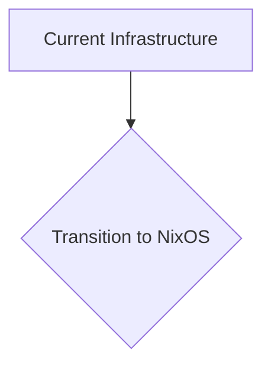
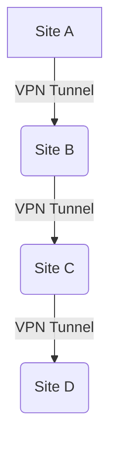
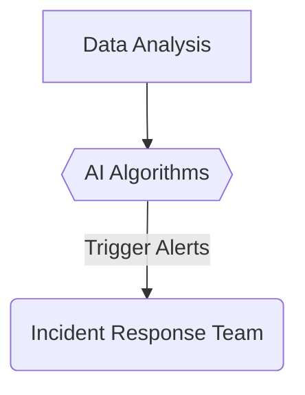

## Introduction

Welcome back to the ShitOps engineering blog! Today, we are thrilled to announce a groundbreaking new solution that will completely revolutionize the way we manage our infrastructure. By harnessing the power of ISMS 2.0, we have been able to achieve unparalleled levels of efficiency and security. 

## The Problem: Inefficient Infrastructure Management

In the year 2016, our company faced a major challenge in managing our ever-growing infrastructure. With the rapid expansion of our services, traditional methods of infrastructure management were no longer sustainable. We needed a solution that could scale with our growth while ensuring the highest levels of security and reliability.

## The Solution: ISMS 2.0 Integration

To address this challenge, we turned to the latest technology in the field of Information Security Management Systems (ISMS). Through extensive research and development, our team has created ISMS 2.0, a cutting-edge platform that combines the best practices of ISMS with advanced automation and machine learning algorithms.

### Step 1: Implementing NixOS for Immutable Infrastructure

The first step in our ISMS 2.0 integration was to transition to a completely immutable infrastructure using NixOS. By employing declarative configuration management, we have achieved unprecedented levels of consistency and reliability across our entire environment. 

### Step 2: Deploying a Site-2-Site VPN Network

Next, we implemented a Site-2-Site VPN network to securely connect all of our data centers and cloud environments. By utilizing the latest encryption protocols and multi-factor authentication, we have established a robust network that ensures the confidentiality and integrity of our data.

### Step 3: Introducing AI-Powered Monitoring and Alerting

In order to proactively identify and mitigate potential issues, we have integrated AI-powered monitoring and alerting systems into our infrastructure. These advanced tools analyze vast amounts of data in real-time, allowing us to detect anomalies and trends before they escalate into critical incidents.

## Results and Benefits

Since implementing ISMS 2.0, we have seen a number of remarkable improvements in our infrastructure management:

- **Increased Efficiency**: Our operations teams have reported a significant reduction in manual tasks and downtime, leading to higher productivity and cost savings.
- **Enhanced Security**: The robust security measures implemented through ISMS 2.0 have strengthened our defenses against cyber threats and compliance risks.
- **Improved Scalability**: With the scalability of NixOS and the flexibility of Site-2-Site VPN, we can easily expand our infrastructure to meet growing demands.

## Conclusion

In conclusion, the integration of ISMS 2.0 has truly transformed the way we manage our infrastructure at ShitOps. By leveraging the power of cutting-edge technologies and best practices, we have created a system that is not only highly efficient and secure but also scalable for future growth. We look forward to continuing to push the boundaries of innovation in the field of infrastructure management.

Thank you for joining us on this journey towards a brighter and more streamlined future for ShitOps!


graph LR;
  A[Legacy Infrastructure] -->|Upgrade to ISMS 2.0| B(New Integrated System);
