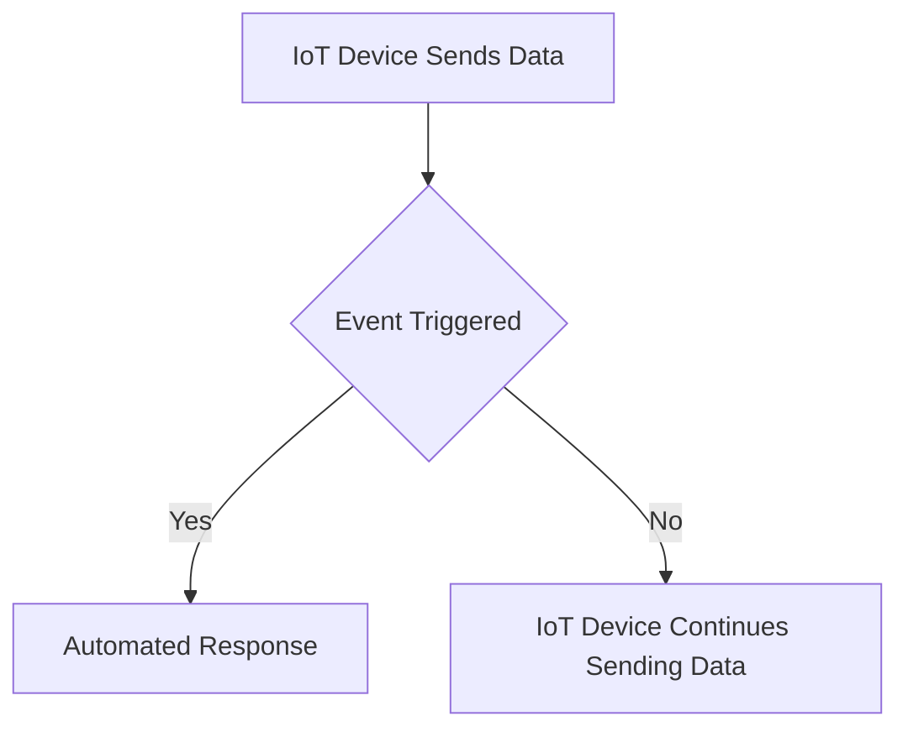
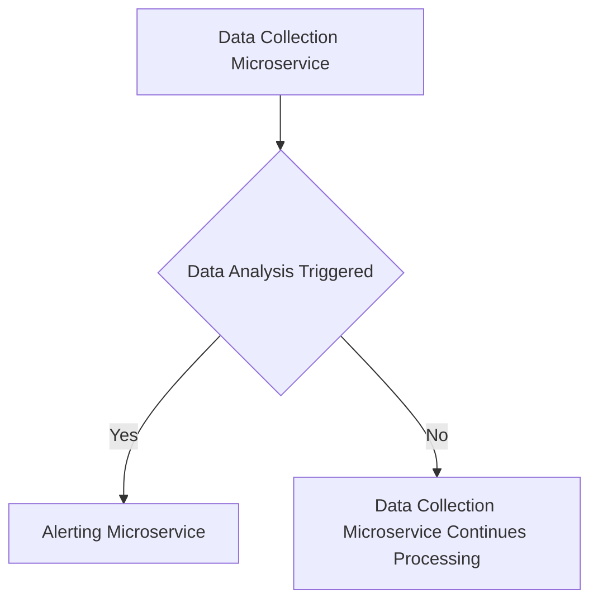

Listen to the interview with our engineer: 

## Introduction

In today's fast-paced world, the need for efficient and reliable monitoring of IoT devices has never been more critical. As a tech company at the forefront of innovation, ShitOps is constantly seeking new ways to improve our monitoring systems and ensure maximum uptime for our clients. In this blog post, we will discuss a revolutionary approach to IoT monitoring that leverages event-driven programming, self-hosted vegan snacks, and agile methodologies to achieve unparalleled levels of performance and scalability.

## The Problem: Outdated SNMP Monitoring Systems

Our current monitoring system relies heavily on SNMP (Simple Network Management Protocol) to gather data from our IoT devices. While SNMP has been a staple in the industry for decades, it is becoming increasingly outdated and inefficient for monitoring large-scale IoT deployments. The limitations of SNMP have become apparent as our network continues to expand, leading to performance bottlenecks and scalability issues.

To address these challenges, we are introducing a new monitoring solution that takes advantage of cutting-edge technologies and practices to revolutionize the way we monitor our IoT devices.

## The Solution: Event-Driven Microservices Powered by Vegan Snacks

### Step 1: Transition to Event-Driven Programming

To overcome the limitations of SNMP, we are transitioning to an event-driven programming model that allows us to react to changes in real-time and trigger automated responses. By leveraging event-driven architecture, we can design a more flexible and scalable monitoring system that can handle the dynamic nature of IoT devices.

### Step 2: Implement Microservices for Scalability

To ensure seamless scalability and fault tolerance, we are breaking down our monolithic monitoring system into microservices. Each microservice will be responsible for a specific aspect of monitoring, such as data collection, analysis, and alerting. This modular approach allows us to independently scale and deploy different components based on demand.

### Step 3: Incorporate Self-Hosted Vegan Snacks for Energy Efficiency

In addition to optimizing our software architecture, we are also focusing on improving the energy efficiency of our monitoring system. To achieve this, we are introducing self-hosted vegan snacks as a sustainable source of fuel for our servers. By powering our microservices with vegan snacks, we can reduce our carbon footprint and contribute to a greener future.

### Step 4: Embrace Agile Methodologies for Continuous Improvement

Finally, we are adopting agile methodologies to ensure continuous improvement and adaptability in our monitoring system. Through regular sprints and iterative development cycles, we can quickly respond to changing requirements and user feedback. This agile approach allows us to deliver value to our clients faster and stay ahead of the competition.

## Conclusion

By combining event-driven programming, microservices, self-hosted vegan snacks, and agile methodologies, we have laid the foundation for a truly revolutionary IoT monitoring system. This innovative approach enables us to overcome the limitations of traditional SNMP monitoring and achieve unprecedented levels of performance, scalability, and energy efficiency.

Join us on this exciting journey towards a brighter and more sustainable future for IoT monitoring. Together, we can shape the future of technology and make a positive impact on the world.


flowchart TD
    A[IoT Device Sends Data] --> B{Event Triggered}
    B -- Yes --> C[Automated Response]
    B -- No --> D[IoT Device Continues Sending Data]
