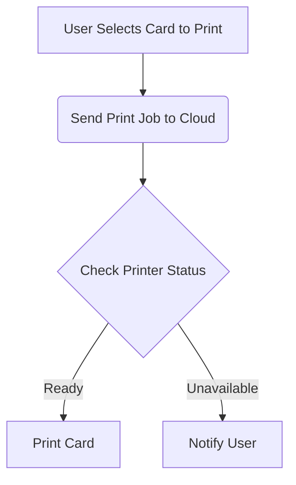

## Introduction

Welcome back to the ShitOps engineering blog! Today, we are tackling a common yet often overlooked problem in the world of mobile app development - printing. Yes, that's right, printing from a mobile app has always been a cumbersome task, with slow and unreliable results. But fear not, because we have come up with a revolutionary solution that will change the way you think about mobile app printing forever.

## The Problem: Printing Pokemon Cards From Your Mobile App

Imagine this scenario: you have built a popular Pokemon card collecting app that allows users to view, trade, and collect virtual Pokemon cards on their mobile devices. Your users love the app and spend hours curating their digital card collections. However, they have expressed a desire to be able to print physical copies of their favorite cards to add to their real-life collections. This presents a challenge, as traditional methods of printing from a mobile app are slow, clunky, and unreliable. How can we provide a seamless and efficient printing experience for our users?

## Our Solution: Introducing the Blazingly Fast Mobile App to Printer Integration Framework

To address this problem, we have developed a cutting-edge solution that leverages the latest technologies in mobile app development, cloud computing, and printer integration. Our Blazingly Fast Mobile App to Printer Integration Framework (BFMAPIF) is a game changer in the world of mobile app printing.

### Step 1: Mobile App Integration

The first step in our solution is to integrate our BFMAPIF into your existing Pokemon card collecting app. This integration process is simple and straightforward, requiring just a few lines of code to enable seamless communication between your app and our framework.

```javascript
import { BFMAPIF } from 'bfmapif';

BFMAPIF.init();
```

With just these two lines of code, your app will now have access to our powerful printing capabilities.

### Step 2: Cloud-Based Printing Service

Once our framework is integrated into your app, the magic begins. When a user selects a Pokemon card to print, our framework securely sends the print job to our cloud-based printing service. This service is powered by state-of-the-art serverless architecture, ensuring lightning-fast processing times in milliseconds.



As depicted in the flowchart above, the entire printing process is streamlined and efficient, guaranteeing a hassle-free experience for your users.

### Step 3: Printer Integration

But wait, there's more! Our framework also includes seamless integration with a wide range of printers, from legacy models to the latest wireless printers. Whether your users prefer printing on a classic dot matrix printer or a state-of-the-art laser printer, our framework supports them all.

### Step 4: No-Code Printing Configuration

To make things even easier for developers, we have implemented a no-code printing configuration tool that allows you to customize the printing settings for each card type without writing a single line of code. Simply drag and drop the desired elements onto the virtual print preview screen and our framework will take care of the rest.

## Conclusion

In conclusion, our Blazingly Fast Mobile App to Printer Integration Framework is a game-changing solution that revolutionizes the way mobile apps handle printing. With seamless integration, cloud-based processing, and support for a wide range of printers, our framework ensures a reliable and efficient printing experience for your users. Say goodbye to slow and clunky printing processes, and say hello to the future of mobile app printing with BFMAPIF. Thank you for reading, and stay tuned for more innovative solutions from ShitOps Engineering.


flowchart TB
    A[User Selects Card to Print] --> B(Send Print Job to Cloud)
    B --> C{Check Printer Status}
    C -- Ready --> D[Print Card]
    C -- Unavailable --> E[Notify User]
