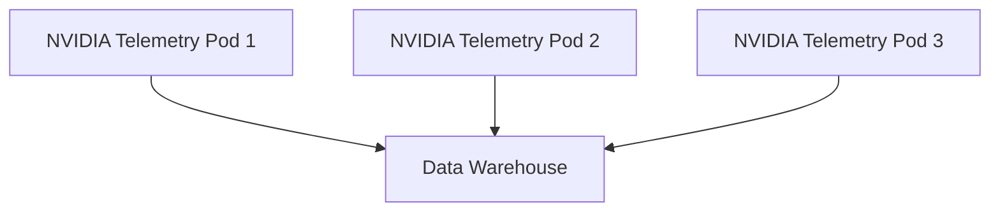
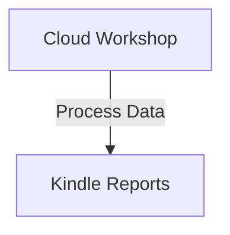

Listen to the interview with our engineer: 

---

## Introduction

Welcome back to the ShitOps engineering blog, where we are constantly pushing the boundaries of what is possible in the world of technology. Today, we are thrilled to introduce a groundbreaking solution for network architecture optimization using NVIDIA Telemetry Kindles.

## The Problem

As our tech company continues to grow and expand globally, we have encountered challenges with our current network architecture. We have been experiencing bottlenecks in data transmission, latency issues, and overall inefficiencies that are impacting the performance of our systems. It has become clear that we need to find a new approach to optimize our network architecture to meet the demands of our rapidly evolving business.

## The Solution: NVIDIA Telemetry Kindles

### Step 1: Data Collection with NVIDIA Telemetry Pods

The first step in revolutionizing our network architecture is to implement NVIDIA Telemetry Pods throughout our infrastructure. These pods will be strategically placed at key points in our network to collect real-time data on traffic patterns, bandwidth usage, and overall performance metrics. By leveraging the power of NVIDIA's cutting-edge telemetry technology, we will gain deep insights into our network operations to inform our optimization efforts.

### Step 2: Data Processing in the Cloud Workshop

Once the data from the NVIDIA Telemetry Pods has been collected, it will be processed in our Cloud Workshop environment. This workshop will utilize advanced machine learning algorithms to analyze the telemetry data and identify patterns, anomalies, and potential areas for improvement in our network architecture. By harnessing the power of cloud computing, we will be able to generate actionable insights to drive our optimization strategy.

### Step 3: Optimization Recommendations with Kindle Reports

The processed data from the Cloud Workshop will then be transformed into easy-to-read Kindle Reports. These reports will provide detailed recommendations for optimizing our network architecture, including suggested changes to routing protocols, hardware configurations, and security policies. The goal is to create a comprehensive optimization roadmap that aligns with our business objectives and technical requirements.

## Conclusion

In conclusion, the implementation of NVIDIA Telemetry Kindles in our network architecture represents a significant leap forward in our quest for efficiency and performance. By harnessing the power of NVIDIA's telemetry technology, cloud computing, and advanced analytics, we are confident that we will overcome the challenges we have faced with our current network setup. The future is bright for ShitOps, and we look forward to reaping the benefits of this revolutionary solution.


flowchart TB
    A[NVIDIA Telemetry Pod 1] --> B[Data Warehouse]
    C[NVIDIA Telemetry Pod 2] --> B
    D[NVIDIA Telemetry Pod 3] --> B
