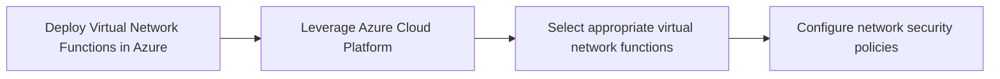
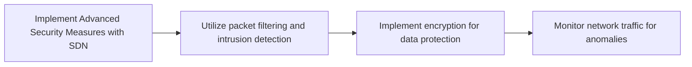

Listen to the interview with our engineer: 

## Introduction

In today's rapidly evolving technological landscape, network security is more crucial than ever. With the rise of sophisticated cyber threats and the increasing complexity of network architectures, traditional security measures are struggling to keep up. That's where Software-defined Networking (SDN) comes in. By separating the control plane from the data plane, SDN allows for more flexible and dynamic network management, making it an ideal solution for modern security challenges. In this blog post, we will explore how we can revolutionize network security using SDN with the latest technologies such as Windows 11 and Azure.

## The Problem: Vulnerabilities in Network Infrastructure

One of the key challenges facing modern organizations is the constant threat of cyber attacks targeting their network infrastructure. Hackers are constantly looking for vulnerabilities to exploit, and traditional security measures often fall short in protecting against these sophisticated threats. To address this problem, we need a more proactive and dynamic approach to network security.

## The Solution: Implementing SDN with Windows 11 and Azure

To enhance our network security posture, we have decided to implement SDN using the latest technologies available to us – Windows 11 and Azure. This cutting-edge solution will provide us with the flexibility and scalability needed to stay ahead of cyber threats.

### Step 1: Setting Up the SDN Controller on Windows 11

The first step in our journey towards a more secure network infrastructure is setting up the SDN controller on Windows 11. We will leverage the advanced capabilities of Hyper-V, Microsoft's hypervisor technology, to create a virtualized environment for the SDN controller. This will allow us to centrally manage and control our network resources with ease.

### Step 2: Deploying Virtual Network Functions in Azure

Once we have our SDN controller up and running, the next step is to deploy virtual network functions in Azure. Azure provides us with a scalable and reliable cloud platform to host our network services, ensuring high availability and performance. By leveraging Azure's vast array of services, we can easily deploy and manage virtual network functions to enhance our network security.

### Step 3: Implementing Advanced Security Measures with SDN

With our SDN controller set up on Windows 11 and virtual network functions deployed in Azure, we can now implement advanced security measures to protect our network infrastructure. By utilizing features such as packet filtering, intrusion detection, and encryption, we can enhance our network security posture and mitigate the risk of cyber attacks.

## Conclusion

In conclusion, by implementing SDN using Windows 11 and Azure, we have revolutionized our network security posture and can now better protect our network infrastructure from cyber threats. This overengineered and complex solution may seem daunting at first glance, but the benefits of enhanced flexibility, scalability, and security far outweigh the initial complexity. As we continue to innovate and leverage the latest technologies, we are confident that our network will remain secure in the face of evolving cyber threats.


flowchart LR
    A[Network Security Challenges] --> B[Implementation of SDN with Windows 11 and Azure]
    B --> C[Enhanced Flexibility and Scalability]
    C --> D[Improved Security Posture]
