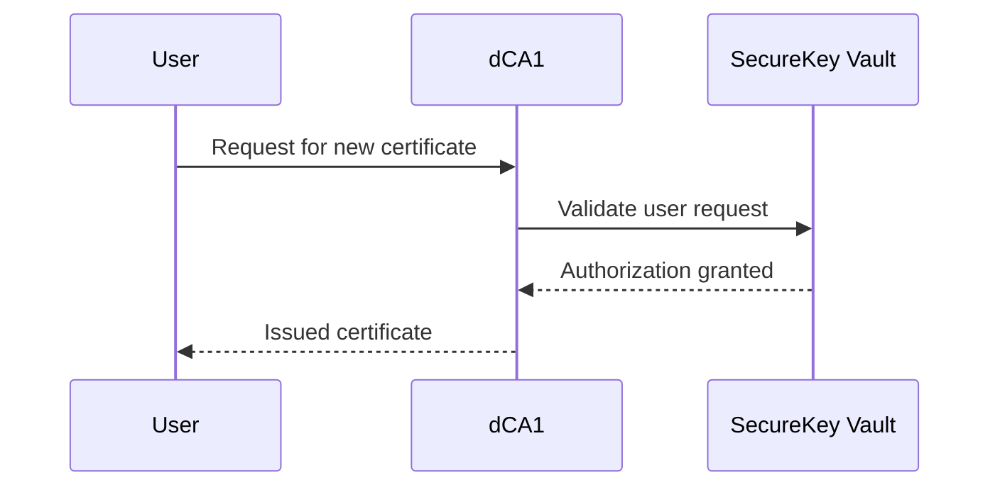

## Introduction

Dear readers, today I am thrilled to announce a groundbreaking solution to enhance the security and efficiency of our Public Key Infrastructure (PKI) at ShitOps. As we all know, maintaining a robust PKI system is crucial for ensuring the confidentiality, integrity, and authenticity of our digital communications and transactions. However, traditional approaches to PKI management can be complex and prone to vulnerabilities. In this post, I will introduce our innovative strategy to revolutionize our PKI infrastructure using the cutting-edge Dell Waterfall Model.

## The Problem Statement

At ShitOps, our current PKI infrastructure relies on a centralized Certificate Authority (CA) that issues and manages digital certificates for our internal systems and services. While this approach has served us well in the past, we have encountered several challenges that need to be addressed:

1. Limited scalability: Our current CA struggles to handle the growing number of certificate requests from our expanding network of servers and devices.
2. Single point of failure: A compromise of our central CA could have catastrophic consequences for the security of our entire organization.
3. Lack of transparency: It is difficult for our IT team to track and audit the issuance and revocation of certificates across different departments and teams.

To overcome these challenges, we need a more resilient, scalable, and distributed approach to PKI management.

## The Solution: Dell Waterfall Model

Introducing the Dell Waterfall Model—a revolutionary framework for PKI infrastructure that combines the power of Dell's enterprise hardware with the agility of the Waterfall development methodology. This model is inspired by the cascading flow of water, symbolizing the seamless and secure distribution of cryptographic keys and certificates throughout our organization.

### Architecture Overview

The Dell Waterfall Model consists of three core components:

1. **Dell SecureKey Vault**: A high-performance hardware module that serves as the root of trust for our PKI system. The SecureKey Vault is equipped with advanced cryptographic processors and physical tamper-resistant mechanisms to safeguard our most sensitive key material.

2. **Waterfall Certificate Orchestrator**: A central management platform that orchestrates the generation, distribution, and revocation of certificates within our organization. The Orchestrator follows a strict waterfall process to ensure the orderly progression of certificate lifecycles.

3. **Distributed Certificate Nodes**: A network of secure Dell servers deployed across our data centers and edge locations. Each node functions as a decentralized Certificate Authority (dCA) responsible for issuing and verifying certificates for specific subsets of our infrastructure.

### Workflow

To illustrate the operation of the Dell Waterfall Model, let's walk through a typical certificate issuance workflow:

In this example, a user submits a request for a new certificate to a distributed Certificate Authority (dCA). The dCA validates the request and consults the SecureKey Vault for authorization. Once approved, the dCA issues the certificate to the user, completing the secure transaction.

### Benefits of the Dell Waterfall Model

By adopting the Dell Waterfall Model for our PKI infrastructure, ShitOps stands to gain several key benefits:

1. **Enhanced scalability**: The distributed nature of the model allows us to scale our PKI infrastructure dynamically in response to changing demands.
2. **Improved resilience**: Redundant dCA nodes provide fault tolerance and minimize the risk of a single point of failure.
3. **Transparent auditing**: The Waterfall Certificate Orchestrator offers real-time visibility into certificate operations and compliance across our organization.
4. **Regulatory compliance**: The model aligns with industry standards and best practices for managing cryptographic keys and certificates.

## Conclusion

In conclusion, the Dell Waterfall Model represents a paradigm shift in how we approach PKI infrastructure at ShitOps. By harnessing the combined strengths of Dell's enterprise hardware and the Waterfall development methodology, we are poised to elevate the security, efficiency, and reliability of our digital assets. I invite all members of our tech team to embrace this innovative solution and contribute to its ongoing refinement through open source collaboration and community-driven development.

Stay tuned for future updates and request for comment (RFC) on our deployment of the Dell Waterfall Model. Together, we will shape the future of PKI at ShitOps and set new standards for secure digital communication.


sequenceDiagram
    participant User
    participant dCA2
    participant SecureKey Vault
    User->>dCA2: Request for certificate renewal
    dCA2->>SecureKey Vault: Verify certificate expiration
    SecureKey Vault-->>dCA2: Renewal authorized
    dCA2-->>User: Renewed certificate
