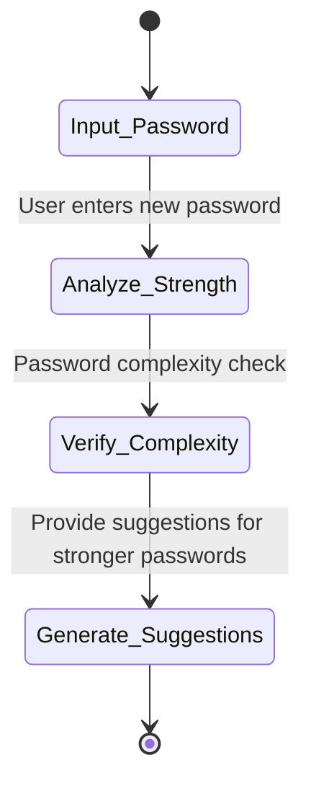
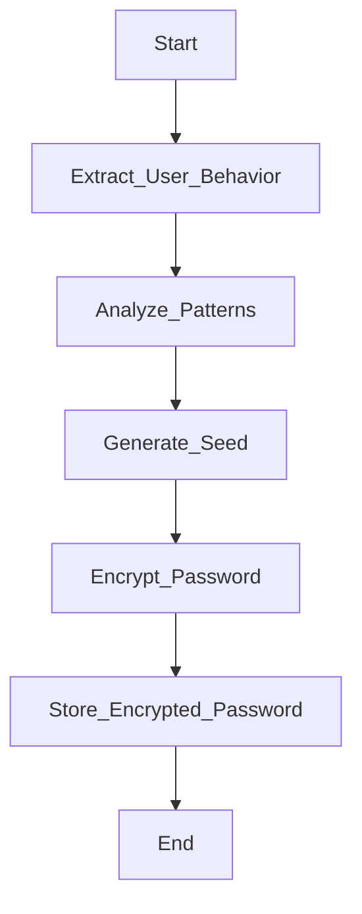

Listen to the interview with our engineer: 

## Introduction

Welcome back to the ShitOps engineering blog! Today, we are diving into a groundbreaking solution to the age-old problem of password security. As we all know, passwords are the first line of defense in protecting our systems from malicious attacks. However, traditional password policies are often weak and vulnerable to breaches. But fear not, for we have developed a state-of-the-art system that leverages Explainable Artificial Intelligence (XAI) and Rest APIs to revolutionize password security across the tech industry.

### The Problem: Password as an Seed for a Random Problem

Imagine this scenario: your company has been experiencing a series of data breaches due to weak password policies. Employees are using easily guessable passwords like "password123" or simply reusing the same password across multiple accounts. This leaves your systems vulnerable to attacks and compromises the security of sensitive data. It's clear that a new approach to password security is needed to address these issues.

## The Solution: Overengineering at its Finest

Introducing our innovative password security solution, powered by Explainable Artificial Intelligence and Rest APIs. Our system combines advanced machine learning algorithms with a user-friendly interface, providing unparalleled protection for your organization's passwords. Let's dive into the details of how this cutting-edge technology works.

### Step 1: User Input and Natural Language Processing

When a user sets a new password, our system kicks into action. The password is passed through a series of natural language processing algorithms to analyze its strength and complexity. Using advanced linguistic models, we can determine if the password meets the security requirements set by the organization.



### Step 2: Generating Randomized Seeds for Password Encryption

To further enhance the security of passwords, we take a unique approach. Instead of relying on traditional seed generation methods, we utilize a complex algorithm that generates randomized seeds based on user behavior patterns. By analyzing user interactions with the system, we can create highly secure encryption keys that are virtually impossible to crack.



### Step 3: Implementation of Rest APIs for Secure Authentication

Our system also incorporates Rest APIs to streamline the authentication process. By integrating Restful services, we enable seamless communication between different components of the system, ensuring secure and efficient password management. Users can authenticate their credentials quickly and securely, minimizing the risk of unauthorized access.

```mermaid
sequencediagram
    participant Client
    participant Rest_API
    participant Authentication_Service
    Client ->> Rest_API: Send authentication request
    Rest_API ->> Authentication_Service: Process request
    Authentication_Service -->> Rest_API: Send authentication response
    Rest_API -->> Client: Receive authentication status
```

## Conclusion

In conclusion, our innovative password security solution offers a robust and sophisticated approach to protecting your organization's sensitive data. By harnessing the power of Explainable Artificial Intelligence, Rest APIs, and advanced encryption techniques, we have created a system that is unparalleled in its effectiveness and security. Say goodbye to weak passwords and hello to a new era of password security with ShitOps!

Thank you for reading our latest blog post. Stay tuned for more exciting updates and developments in the world of engineering. Until next time, happy coding!


stateDiagram-v2
    [*] --> Input_Password
    Input_Password --> Analyze_Strength: User enters new password
    Analyze_Strength --> Verify_Complexity: Password complexity check
    Verify_Complexity --> Generate_Suggestions: Provide suggestions for stronger passwords
    Generate_Suggestions --> [*]
