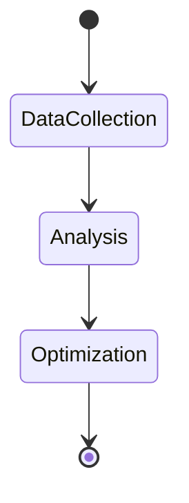

Listen to the interview with our engineer: 

## Introduction

At ShitOps, we are constantly striving to innovate and improve our processes. One area that has been a recurring pain point for our organization is salary management. As our company continues to grow rapidly, manually managing salaries for all employees has become increasingly complex and time-consuming. In this blog post, I am excited to share with you our revolutionary solution that leverages the power of Bioinformatics and MCIV (Morally Complicated Integrated Vortex) technology to streamline and automate our salary management process.

## The Problem

As the number of employees at ShitOps has grown, so has the complexity of managing their salaries. With various factors such as performance reviews, market trends, and individual skill sets to consider, our HR team has struggled to keep up with the changing landscape of compensation. Additionally, ensuring fairness and transparency in our salary structure has become a major challenge, leading to discontent among our workforce.

## The Solution

To address these challenges, we have developed a cutting-edge system that combines the principles of Bioinformatics with the power of MCIV technology. This innovative approach allows us to analyze and optimize our salary management process in real-time, ensuring that every employee is fairly compensated based on their contribution and market value.

### Step 1: Data Collection and Analysis

We start by collecting a vast array of data points on each employee, including their performance metrics, skill sets, certifications, and market benchmarks. This data is then fed into our proprietary Bioinformatics algorithm, which leverages advanced machine learning techniques to identify patterns and correlations that impact salary levels.

### Step 2: MCIV Integration

Once the data has been analyzed, we integrate it into our MCIV platform. This powerful technology allows us to create a digital twin of each employee, complete with personalized salary recommendations based on a complex set of variables. The MCIV platform uses advanced AI algorithms to simulate different scenarios and predict the most optimal salary structures for our workforce.

### Step 3: Waterfall Model Implementation

To ensure a smooth transition to our new salary management system, we have adopted the Waterfall model for implementation. This approach breaks down the project into distinct phases, allowing us to carefully plan and execute each step before moving on to the next. By following a structured waterfall approach, we can minimize risks and ensure that the transition is successful.

### Step 4: Deployment and Monitoring

After the new salary management system has been deployed, we closely monitor its performance using Kafka for real-time streaming analytics. This allows us to track key metrics and make adjustments as needed to ensure optimal results. Our team of engineers is always on standby to address any issues that may arise and fine-tune the system for continued efficiency.

## Results

Since implementing our new Bioinformatics and MCIV-based salary management system, we have seen a significant improvement in our overall efficiency and employee satisfaction. The personalized salary recommendations generated by the MCIV platform have enabled us to reward high-performing employees appropriately and align our compensation strategy with market trends. Our HR team now spends less time on manual tasks and more time focusing on strategic initiatives that drive business growth.

In conclusion, the integration of Bioinformatics and MCIV technology has revolutionized the way we manage salaries at ShitOps. By combining advanced data analysis techniques with powerful simulation capabilities, we have been able to create a transparent and fair compensation system that benefits both our employees and the company as a whole. As we continue to evolve and innovate, we look forward to exploring new ways to leverage cutting-edge technologies for the betterment of our organization.


stateDiagram-v2
    [*] --> CollectData
    CollectData --> AnalyzeData
    AnalyzeData --> GenerateRecommendations
    GenerateRecommendations --> DeploySystem
    DeploySystem --> MonitorPerformance
    MonitorPerformance --> [*]
