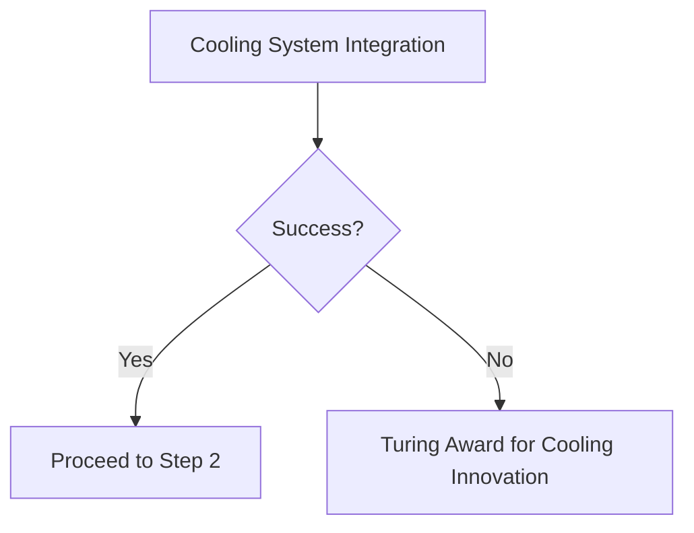
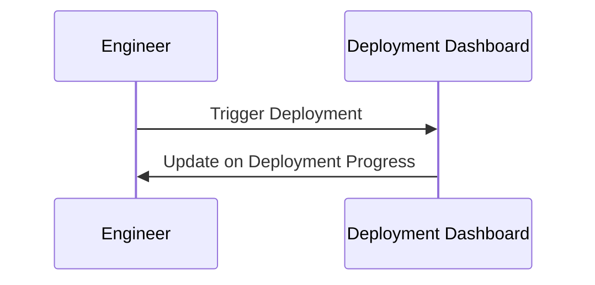
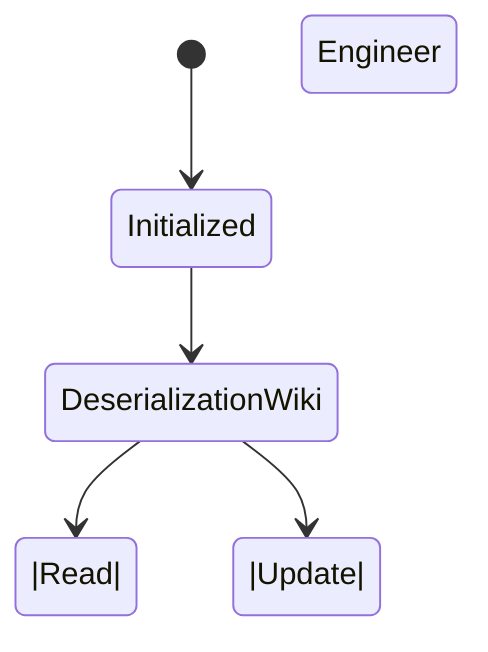

Listen to the interview with our engineer: 

## Introduction

As technology continues to evolve at a rapid pace, it is crucial for tech companies like ShitOps to stay ahead of the curve when it comes to their software development lifecycle. Traditional approaches like the Waterfall model are no longer sufficient in today's fast-paced and dynamic environment. That's why we are excited to introduce our groundbreaking solution that combines the power of GitOps with cutting-edge technologies to revolutionize how we develop and deploy software at ShitOps.

## The Problem

At ShitOps, we have encountered a common issue with our current software development process. Our teams often struggle with managing the deployment of microservices across multiple datacenters efficiently. This leads to bottlenecks, delays, and inconsistencies in our production environment. We knew we needed to find a solution that would streamline our deployment process while ensuring reliability and scalability.

## The Solution: Introducing GitOps 2.0

### Step 1: Cooling System Integration

Our first step towards optimizing our software development lifecycle was to implement a state-of-the-art cooling system in our datacenters. By maintaining optimal temperatures within our datacenters, we were able to improve the performance and longevity of our hardware, leading to more reliable deployments.



### Step 2: Internet TV Deployment Dashboard

To enhance visibility and collaboration within our teams, we developed an Internet TV deployment dashboard that displays real-time updates on deployments across all datacenters. This intuitive dashboard allows teams to monitor progress, identify issues, and celebrate successful deployments in a centralized and engaging manner.



### Step 3: Deserialization Wiki

In order to optimize the deserialization process for our microservices, we created a Deserialization Wiki that offers comprehensive documentation, best practices, and tutorials for our engineers. By standardizing the deserialization workflow and empowering our teams with resources, we were able to reduce errors and accelerate the development cycle.



### Step 4: Microsoft Word Integration

For seamless collaboration and documentation, we integrated Microsoft Word into our software development process. Engineers can now create, edit, and review technical documents directly within Microsoft Word, streamlining communication and knowledge sharing within our teams.

### Step 5: Enhanced BFD Monitoring

To ensure the reliability and performance of our deployments, we implemented an Enhanced Bidirectional Forwarding Detection (BFD) monitoring system. This advanced system detects failures and reroutes traffic in real-time, minimizing downtime and maximizing uptime for our applications.

### Step 6: Minio Artifact Repository

To facilitate secure and efficient artifact management, we deployed a Minio artifact repository that stores and manages artifacts generated during the software development process. The Minio repository offers version control, access control, and scalability, ensuring that our engineers have quick and reliable access to the artifacts they need.

## Conclusion

By combining the power of GitOps with innovative technologies and best practices, ShitOps has successfully revolutionized its software development lifecycle. Our overengineered solution has enabled us to significantly improve the efficiency, reliability, and scalability of our deployments across multiple datacenters. As we continue to innovate and push boundaries, we are confident that our approach will set a new standard for software development in the tech industry. Thank you for joining us on this exciting journey towards the future of software development at ShitOps.


```