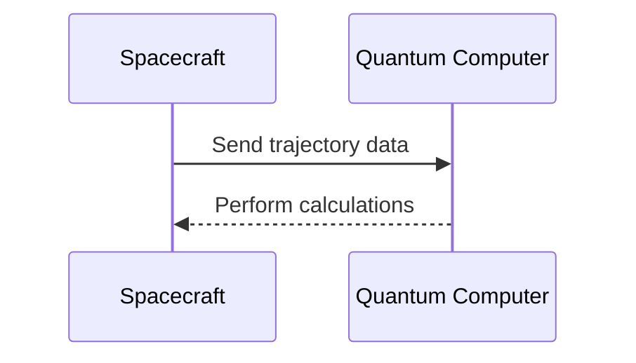
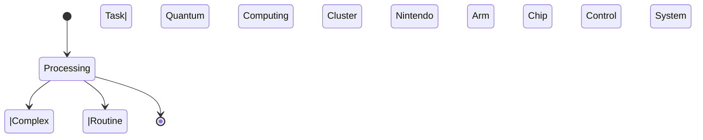

Listen to the interview with our engineer: 

---

## Introduction

Greetings, fellow engineers and tech enthusiasts! Today, I am thrilled to share with you a groundbreaking solution that will revolutionize the way we approach space exploration. By harnessing the power of quantum computing and incorporating Nintendo Arm chips into our systems, we are taking a giant leap forward in our quest to unlock the mysteries of the universe.

## The Problem

Space exploration has always been a challenging endeavor, requiring immense computing power and cutting-edge technology to navigate the vast expanse of the cosmos. Traditional computing systems have limitations when it comes to processing the massive amounts of data required for tasks such as trajectory calculations, image analysis, and communication with distant satellites. Additionally, the harsh conditions of space can wreak havoc on delicate electronics, leading to frequent malfunctions and system failures.

## The Solution

To overcome these challenges, we have developed a hybrid system that combines the power of quantum computing with the reliability of Nintendo Arm chips. This innovative approach leverages the strengths of both technologies to create a robust and efficient platform for space exploration.

### Step 1: Quantum Computing Cluster

Our first step is to set up a state-of-the-art quantum computing cluster onboard our spacecraft. This cluster will be powered by a D-Wave quantum computer, capable of performing complex calculations at speeds far beyond those of traditional supercomputers. By utilizing quantum algorithms, we can optimize our trajectory calculations, process sensor data in real-time, and even simulate different scenarios to ensure the safety of our mission.



### Step 2: Nintendo Arm Chip Control System

In addition to the quantum computing cluster, we will implement a control system based on Nintendo Arm chips. These chips are known for their low power consumption, compact size, and robust performance – perfect for operating in the harsh environment of space. The Arm chips will handle the day-to-day operations of the spacecraft, including navigation, communication with ground control, and monitoring vital systems.

```mermaid
flowchart LR
    Start --> Initialize Nintendo Arm Chip System
    Initialize Nintendo Arm Chip System --> Handle Navigation
    Initialize Nintendo Arm Chip System --> Communicate with Ground Control
    Initialize Nintendo Arm Chip System --> Monitor Vital Systems
```

### Step 3: Hybrid Data Processing

To maximize the efficiency of our system, we will implement a hybrid data processing framework that leverages both the quantum computing cluster and the Nintendo Arm chip control system. This framework will intelligently distribute computational tasks based on their complexity and urgency, ensuring optimal performance while conserving energy.



## Conclusion

By combining the power of quantum computing with the reliability of Nintendo Arm chips, we have created a cutting-edge solution for space exploration that pushes the boundaries of what is possible. With this revolutionary system in place, we are poised to unlock the secrets of the universe and pave the way for future generations of explorers to follow in our footsteps. Thank you for joining me on this journey of innovation and discovery. Until next time, happy engineering! 


```mermaid
flowchart TB
    Start --> quantum computing cluster
    Start --> nintendo arm chip control system
    quantum computing cluster --> hybrid data processing
    nintendo arm chip control system --> hybrid data processing
    hybrid data processing --> End
```
