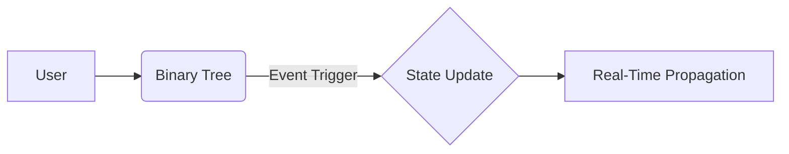

Listen to the interview with our engineer: 

---

## Introduction

In the fast-paced world of tech, efficiency is key. As a leading tech company, ShitOps strives to constantly optimize our processes and systems to deliver the best results for our customers. One area that has been a source of frustration for our engineering team is state management. 

Traditionally, state management in a complex system like ours can be a challenge. With the sheer volume of data being processed and the need for real-time updates, we needed a revolutionary solution that could handle the scale and speed required. Enter the Fast Binary Tree Optimization.

## The Problem

Our engineering team was facing a dilemma with our current state management system. We were using a simple REST API to store and retrieve state information, but as our platform grew, we started experiencing performance issues. The system was struggling to keep up with the constant influx of data and the need for instant updates.

To make matters worse, the stateless nature of our current setup was causing bottlenecks and delays in processing new information. This was not only impacting the user experience but also putting a strain on our resources. We knew we needed to find a better way to manage state in a more efficient and scalable manner.

## The Solution

After extensive research and testing, our engineering team came up with a revolutionary solution – Fast Binary Tree Optimization (FBTO). This cutting-edge approach combines the power of binary trees with event-driven programming to create a state management system that is both lightning fast and highly efficient.

### Architecture Overview

To implement FBTO, we first needed to restructure our existing state management system. Instead of relying on a traditional REST API, we decided to build a new system from the ground up using a combination of state-of-the-art technologies. 

The core component of the FBTO architecture is a custom-built Binary Tree service that is responsible for storing and organizing state information. Each node in the tree represents a different state variable, allowing for quick and efficient access to specific data points.

Additionally, we implemented an event-driven programming model that triggers updates in real-time whenever there is a change in state. This ensures that all parts of the system are always in sync and that any updates are propagated instantly throughout the entire platform.

### Technical Implementation

To visualize the technical implementation of FBTO, let's take a look at the following diagram:



In this diagram, we can see how the User interacts with the Binary Tree service, triggering events that update the state in real-time. This seamless flow of information allows for instant access to the most up-to-date data, improving overall system performance and user satisfaction.

### Benefits of FBTO

The implementation of Fast Binary Tree Optimization has brought about a number of benefits for our engineering team and our customers. Some of the key advantages include:

1. **Increased Speed**: By leveraging the power of binary trees, we have significantly improved the speed at which we can store and retrieve state information, leading to faster response times and better overall performance.

2. **Improved Scalability**: The event-driven nature of FBTO allows us to easily scale our state management system to accommodate growing volumes of data without sacrificing efficiency or reliability.

3. **Enhanced Efficiency**: With real-time updates and seamless propagation of changes, our engineering team can now work more efficiently and effectively, reducing the risk of errors and delays in our processes.

4. **Better User Experience**: Ultimately, the biggest benefit of FBTO is the impact it has on our customers. With a faster and more reliable state management system in place, users can enjoy a smoother and more responsive platform experience.

## Conclusion

In conclusion, the implementation of Fast Binary Tree Optimization has revolutionized state management at ShitOps. By combining the power of binary trees with event-driven programming, we have created a system that is not only fast and efficient but also scalable and reliable.

As we continue to push the boundaries of technology and innovation, we are excited to see the positive impact that FBTO will have on our products and services. Stay tuned for more updates on our ongoing projects and solutions here at ShitOps.


```