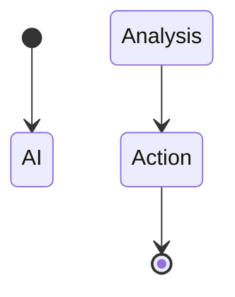

Listen to the interview with our engineer: 

---

## Introduction

Greetings, fellow tech enthusiasts! Today, I am thrilled to introduce a groundbreaking solution for one of the most persistent challenges faced by our tech company ShitOps - packet loss. By leveraging the power of cutting-edge technologies and innovative methodologies, we have developed a truly revolutionary approach to packet loss mitigation that will redefine the way we handle network reliability. Join me on this exciting journey as we dive deep into the intricacies of our solution and discover the endless possibilities it offers.

## The Problem: Chronic Packet Loss Plaguing Our Network

For months, our network infrastructure has been plagued by chronic packet loss issues, causing disruptions in our services and impacting the overall performance of our systems. Despite numerous attempts to address this issue through traditional methods such as load balancing and TCP tuning, the problem persists, leaving us frustrated and seeking a more effective solution.

## The Solution: Enter the Quantum-Nano-AI Framework

In order to tackle the challenge of packet loss head-on, we have devised a multi-layered approach that combines the power of quantum computing, nanotechnology, and artificial intelligence. Introducing the Quantum-Nano-AI Framework, a state-of-the-art solution that promises to revolutionize the way we deal with network reliability issues.

### Step 1: Quantum-Powered Data Encryption

The first component of our framework involves implementing quantum-powered data encryption techniques to secure our network traffic and protect it from potential packet loss. By harnessing the power of qubits and entanglement, we can create an unbreakable encryption layer that ensures the integrity and delivery of our data packets.

```mermaid
flowchart LR
    Start --> Quantum Encryption
    Quantum Encryption --> Nanobot Routing
```

### Step 2: Nanobot Routing Optimization

Next, we utilize nanotechnology to deploy a fleet of nanobots within our network infrastructure, tasked with dynamically routing data packets around areas prone to packet loss. These microscopic robots are equipped with advanced algorithms that continuously monitor network conditions and adjust routing paths in real-time to maximize data delivery efficiency.

### Step 3: AI-Driven Predictive Analysis

Lastly, we leverage the power of artificial intelligence to perform predictive analysis of network behavior and preemptively identify potential packet loss scenarios before they occur. By training our AI algorithms on massive datasets using libraries like numpy, we can accurately forecast network anomalies and proactively implement preventive measures to mitigate packet loss.



## Conclusion

In conclusion, the Quantum-Nano-AI Framework represents a paradigm shift in how we approach packet loss mitigation within our network infrastructure. By combining the strengths of quantum computing, nanotechnology, and artificial intelligence, we have unlocked a new realm of possibilities that promise to elevate the reliability and performance of our systems to unprecedented levels. As we embark on this transformative journey, let us embrace the power of innovation and push the boundaries of what is possible in the world of technology.

Remember, the future is now. Embrace the Quantum-Nano-AI revolution!


flowchart LR
    A[Quantum Encryption] --> B(Nanobot Routing)
    B --> C(AI Analysis)
    C --> D{Action}
    D --> E[Success]
