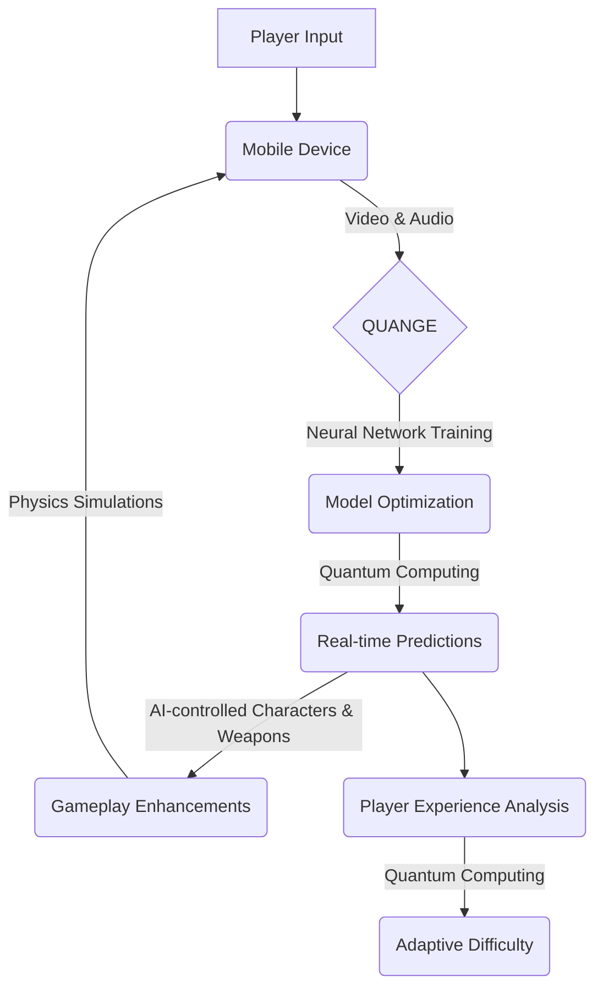

## Introduction

Welcome back to another exciting blog post from the engineering team at ShitOps! Today, we are thrilled to announce our groundbreaking solution to revolutionize the world of mobile gaming using a combination of neural networks and quantum computing. Get ready to embark on an extraordinary journey that will transcend your gaming experience. Let's dive right in!

## The Problem: Leveraging Quantum Computing for Enhancing Mobile Gaming Performance

At ShitOps, we recognized a critical challenge in the mobile gaming industry: the limitations of processing power for highly complex games running on smartphones and tablets. As game developers push the boundaries of graphics, physics simulations, and artificial intelligence, traditional hardware platforms struggle to keep up with the demanding requirements.

To address this problem, we wanted to leverage advanced technologies that could unlock unprecedented performance gains while ensuring an immersive and seamless gaming experience. This led us to explore the potential of neural networks and quantum computing, two cutting-edge fields that hold promise for solving this computational bottleneck.

## The Solution: The Quantum Neural Gaming Engine (QUANGE)

Introducing QUANGE, our revolutionary Quantum Neural Gaming Engine designed to unleash the true power of mobile gaming. This state-of-the-art engine combines the capabilities of neural networks and quantum computing to deliver unparalleled performance and realism.

### Overview of QUANGE Architecture

To understand the intricacies of QUANGE, let's take a closer look at its architecture. At its core, QUANGE consists of three major components:

1. **Quantum Processing Unit (QPU)**: The QPU serves as the foundation of QUANGE, harnessing the power of quantum computing to perform complex calculations and simulations in parallel. With its ability to process multiple states simultaneously, the QPU provides a massive speed advantage over traditional processors.

2. **Neural Network Framework (NNF)**: The NNF is responsible for training and optimizing neural networks specifically tailored for mobile gaming. Leveraging advanced machine learning techniques, the NNF enables QUANGE to learn and adapt to the unique characteristics of different game styles, ensuring optimal gameplay performance.

3. **Quantum Accelerated Graphics Processor (QAGP)**: The QAGP takes advantage of the QPU's processing capabilities to accelerate graphics rendering and physics calculations. By offloading these tasks to the QPU, QUANGE frees up valuable system resources, enabling smoother framerates and more realistic visuals.

### Quantum Machine Learning for Gaming

One of the most exciting aspects of QUANGE is its integration of quantum machine learning algorithms specifically developed for gaming. Through extensive analysis of player behavior and game patterns, QUANGE learns to anticipate user actions and tailor the gaming experience in real-time.

Let's take a look at an example of how QUANGE utilizes neural networks and quantum computing to enhance a mobile shooting game:

In this flowchart, we can see the seamless integration of neural network training, quantum computing, and real-time predictions within the QUANGE framework. As the player interacts with the game through their mobile device, QUANGE continuously analyzes their inputs and refines its neural network models for optimal gameplay enhancements. The QPU performs lightning-fast quantum calculations to generate real-time predictions, seamlessly integrating AI-controlled characters and weapons into the game.

Furthermore, QUANGE leverages its quantum computing capabilities to analyze the player's experience and adapt the game's difficulty on the fly. This adaptive difficulty feature ensures that each gaming session remains challenging and engaging, tailored to the player's unique skill level and preferences.

## Benefits of QUANGE

By embracing the power of quantum computing and neural networks, QUANGE offers a host of benefits that set it apart from conventional mobile gaming engines:

1. **Unparalleled Performance**: QUANGE's integration of quantum processing capabilities enables lightning-fast computations, resulting in smoother framerates, more responsive gameplay, and stunning visuals.

2. **Real-Time Adaptive Gameplay**: QUANGE's dynamic neural network models continuously adapt to players' behavior, providing personalized and challenging experiences with every playthrough.

3. **Immersive AI Integration**: By leveraging the QPU's power, QUANGE effortlessly incorporates AI-controlled characters and weapons into the gameplay, enhancing both single and multiplayer mobile gaming experiences.

4. **Enhanced Physics Simulations**: With its ability to handle complex physics calculations, QUANGE delivers realistic interactions and environmental dynamics, elevating the overall gameplay experience to new heights.

## QUANGE in Action: Hypernova - The Quantum Frontier

To demonstrate the true potential of QUANGE, we have developed a captivating mobile game called "Hypernova - The Quantum Frontier." In this innovative game, players embark on an intergalactic adventure, battling alien civilizations using advanced weapons and technologies.

The seamless integration of QUANGE's quantum computing and neural network capabilities allows "Hypernova" to offer an unparalleled gaming experience. From stunning graphics and immersive AI-controlled enemies to adaptive difficulty settings and seamless multiplayer interactions, "Hypernova" is the epitome of cutting-edge mobile gaming.

## Conclusion

ShitOps' QUANGE Quantum Neural Gaming Engine represents a giant leap forward in mobile gaming technology, pushing the boundaries of what's achievable on conventional hardware platforms. By harnessing the power of neural networks and quantum computing, QUANGE offers unrivaled performance, realism, and adaptive gameplay experiences.

As we continue to fine-tune QUANGE and expand its capabilities, we are excited to see how it will revolutionize the future of mobile gaming. Stay tuned to our blog for more updates on the latest advancements in gaming technology!


stateDiagram-v2
[*] --> QUANGE
QUANGE --> Hypernova
